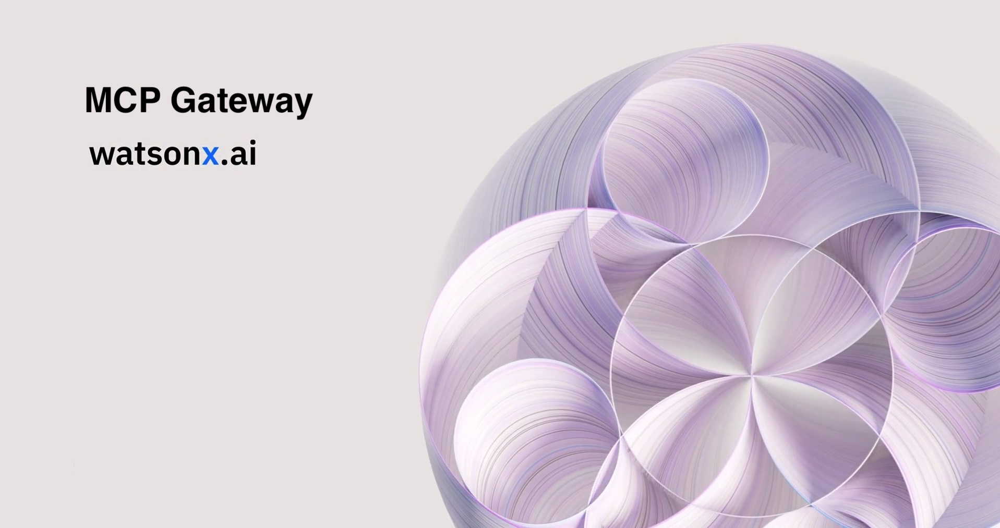

# MCP Context Forge Masterclass

<p align="center">
  <a href="https://www.python.org" target="_blank"></a>
  <a href="https://fastapi.tiangolo.com" target="_blank"></a>
  <a href="https://www.docker.com" target="_blank"></a>
  <a href="https://ruslanmv.com/mcp-gateway-workshop/" target="_blank"></a>
  <a href="LICENSE" target="_blank"></a>
</p>

<div align="center">
  
</div>

---

## Overview

The **MCP Context Forge Masterclass** is a complete, from-zero-to-hero workshop for building **governed, production-grade agentic AI** with the **Model Context Protocol (MCP) Gateway**.

**What is the MCP Context Forge?**  
It’s a policy and connectivity layer between **agents/clients** and **tools/data**. Instead of wiring each agent directly to dozens of APIs, you centralize:
- **Tool registration & discovery** (MCP servers, REST adapters, wrappers)
- **Guardrails** (RBAC, rate limits, secrets/PII filters, schema guards)
- **Observability** (structured logs, correlation IDs, OTEL traces)
- **Governance** (tenancy, on-behalf-of, audit readiness)

By the end, you will:
- Run the **MCP Context Forge** locally (and optionally via Docker Compose)
- Register and **federate tools** from MCP servers and REST adapters
- Enforce **guardrails** at the edge
- Capture **observability** with **Phoenix**
- Ship a **capstone**: a **CrewAI** agent consuming a **Langflow** tool **via the Gateway**
- (Bonus) Build a **Docling + IBM watsonx.ai** RAG chatbot behind the Gateway

**Full docs (MkDocs):** `make docs-serve` → open http://127.0.0.1:8000  
**Code tour under `src/`:** see [`src/README.md`](src/README.md)

---

## Table of Contents

- [MCP Context Forge Masterclass](#mcp-context-forge-masterclass)
  - [Overview](#overview)
  - [Table of Contents](#table-of-contents)
  - [Prerequisites](#prerequisites)
  - [Quick Starts](#quick-starts)
    - [A) Makefile + uv (recommended)](#a-makefile--uv-recommended)
    - [B) Docker Compose (everything at once)](#b-docker-compose-everything-at-once)
    - [C) Manual (no Docker)](#c-manual-no-docker)
  - [Run the Workshop](#run-the-workshop)
    - [Day-1 Labs](#day-1-labs)
    - [Day-2 Capstone](#day-2-capstone)
  - [Bonus: Docling + IBM watsonx.ai RAG via MCP Context Forge](#bonus-docling--ibm-watsonxai-rag-via-mcp-context-forge)
    - [1) Install \& environment](#1-install--environment)
    - [2) Start the Docling MCP server](#2-start-the-docling-mcp-server)
    - [3) Register with the Gateway](#3-register-with-the-gateway)
    - [4) Chat through the Gateway (no direct access to Docling)](#4-chat-through-the-gateway-no-direct-access-to-docling)
  - [Configuration \& Environment](#configuration--environment)
  - [Observability (Phoenix + OTEL)](#observability-phoenix--otel)
  - [Project Layout](#project-layout)
  - [Makefile Targets](#makefile-targets)
  - [Troubleshooting](#troubleshooting)
  - [Contributing](#contributing)
  - [License](#license)
  - [Acknowledgments](#acknowledgments)

---

## Prerequisites

- **Python 3.11+**
- **git**, **curl**, **jq**
- **Docker** & **Docker Compose** (optional but recommended)
- (Optional) **VS Code** + **Dev Containers** for a one-click setup

---

## Quick Starts

### A) Makefile + uv (recommended)

> The Makefile uses **uv** to create/sync a virtual environment and run tools without polluting your global Python.

```bash
# 1) Create the environment and install deps (installs uv if missing)
make install

# 2) Serve docs locally (optional)
make docs-serve

# 3) Build docs in strict mode (optional)
make docs-build
````

Start the gateway (choose one):

```bash
# Option 1: Use your own gateway binary
mcpgateway --host 0.0.0.0 --port 4444

# Option 2: Use Docker Compose service (see below)
docker compose up -d gateway
```

Generate a demo JWT and keep it handy:

```bash
make token
# prints a token — export it for later use
export TOKEN="$(make token | tail -n 1)"
```

### B) Docker Compose (everything at once)

Bring up **Langflow**, **adapter**, (optional) **agent**, **gateway**, and **Phoenix**:

```bash
docker compose up -d
docker compose ps
```

* Langflow: [http://localhost:7860](http://localhost:7860)
* Gateway:  [http://localhost:4444/health](http://localhost:4444/health)
* Phoenix:  [http://localhost:6006](http://localhost:6006)

> You’ll still need a **JWT** to call protected endpoints. Use `make token` or `scripts/create_jwt.py`.

### C) Manual (no Docker)

```bash
# venv + gateway (if you want to run the gateway locally)
python3 -m venv .venv && source .venv/bin/activate
pip install -U mcp-contextforge-gateway
mcpgateway --host 0.0.0.0 --port 4444

# Adapter (for the capstone)
pip install -U fastapi uvicorn requests
uvicorn src.mcpws.adapters.langflow_adapter:app --port 9100
```

Register the adapter:

```bash
export BASE_URL=http://localhost:4444
export TOKEN=<bearer-token>  # from `make token` or your gateway’s jwt tool

curl -s -X POST -H "Authorization: Bearer $TOKEN" -H "Content-Type: application/json" \
  -d '{"name":"langflow","url":"http://localhost:9100","enabled":true,"request_type":"STREAMABLEHTTP"}' \
  $BASE_URL/gateways | jq '.'
```

---

## Run the Workshop

### Day-1 Labs

* **Lab 0** – Environment checks
* **Lab 1** – Gateway up + health check
* **Lab 2** – First MCP server: **calculator** (`calc.add`)

  ```bash
  uv run -- uvicorn src.mcpws.servers.calculator_server:app --port 9100
  ```
* **Lab 3** – Clients & CLI
* **Lab 4** – Wrapper / passthrough: **httpbin** (`httpbin.get`)

  ```bash
  uv run -- uvicorn src.mcpws.servers.httpbin_wrapper:app --port 9200
  ```
* **Lab 5** – Guardrails: enable **rate limiter** and provoke **429**

> All CLIs, curl examples, policies, and screenshots are in the docs site.
> For per-folder, per-lab code pointers and exact commands, see [`src/README.md`](src/README.md).

### Day-2 Capstone

* Build a **Langflow** summarizer flow (text in → summary out)
* Run the **adapter**: exposes `lf.summarize` as an MCP tool
* Register with the **Gateway**
* Run the **CrewAI** agent that calls the gateway tool
* Turn on **RBAC**, **secrets detection**, and **tracing**; collect proofs

Minimal end-to-end (no Docker):

```bash
# Langflow (build your flow at :7860)
pip install -U langflow
langflow run --host 0.0.0.0 --port 7860

# Adapter
uv run -- uvicorn src.mcpws.adapters.langflow_adapter:app --port 9100

# Register & verify
make seed
curl -s -H "Authorization: Bearer $TOKEN" http://localhost:4444/tools | jq '.[] | {name, gateway: .gatewaySlug}'

# Agent
uv run -- python -m src.mcpws.agents.crew_agent
```

---

## Bonus: Docling + IBM watsonx.ai RAG via MCP Context Forge

This appendix turns real-world PDFs/images into a **multimodal RAG chatbot**—fully governed behind the Gateway.

**Why Docling?**
It converts messy documents (PDFs, Office files, scanned images) into clean, structured text (and optional images), preserving headings/tables and enabling multimodal context.

### 1) Install & environment

```bash
uv run --with "docling" \
       --with "ibm-generative-ai" \
       --with "chromadb" \
       --with "sentence-transformers" \
       --with "python-multipart" \
       --with "pydantic" \
       --with "fastapi" \
       --with "uvicorn" -- python -c "print('deps ready')"
```

Set watsonx.ai vars (or use local embeddings with `USE_LOCAL_EMBEDDINGS=1`):

```bash
export WATSONX_API_KEY="<your-ibm-cloud-api-key>"
export WATSONX_PROJECT_ID="<your-project-id>"
export WATSONX_URL="https://us-south.ml.cloud.ibm.com"
export WATSONX_EMBED_MODEL="sentence-transformers/all-minilm-l6-v2"
export WATSONX_LLM_MODEL="meta-llama/llama-4-scout-17b-16e-instruct"

# Local dev fallback (no IBM key needed)
export USE_LOCAL_EMBEDDINGS=1
```

### 2) Start the Docling MCP server

The server exposes three tools: `docling.parse`, `docling.ingest`, `docling.query`.

```bash
uv run -- uvicorn src.mcpws.servers.docling_mcp_server:app --host 0.0.0.0 --port 9200
```

Smoke test:

```bash
# Parse single file
curl -s -F return_images=false -F file=@/path/to/file.pdf \
  http://localhost:9200/call/docling.parse | jq '.text | length'

# Ingest multiple
curl -s -F files=@one.pdf -F files=@two.pdf \
  -F metas='{"tenant":"acme"}' \
  http://localhost:9200/call/docling.ingest | jq .

# Query
curl -s -H 'Content-Type: application/json' \
  -d '{"query":"What is the warranty period?","k":4}' \
  http://localhost:9200/call/docling.query | jq .
```

### 3) Register with the Gateway

```bash
export BASE_URL=http://localhost:4444
export TOKEN=$TOKEN  # from `make token`

curl -s -X POST -H "Authorization: Bearer $TOKEN" \
  -H 'Content-Type: application/json' \
  -d '{
    "name": "docling",
    "url": "http://localhost:9200",
    "description": "Docling RAG Server",
    "enabled": true,
    "request_type": "STREAMABLEHTTP"
  }' \
  $BASE_URL/gateways | jq '.'

curl -s -H "Authorization: Bearer $TOKEN" $BASE_URL/tools | jq '.[] | {name, gateway: .gatewaySlug}'
```

### 4) Chat through the Gateway (no direct access to Docling)

```bash
# Simple gateway client
uv run -- python -m src.mcpws.tools.chat_rag_client
# Env it uses:
#   GATEWAY_URL (default http://localhost:4444)
#   GATEWAY_TOKEN (your JWT)
```

You should see a grounded answer plus source metadata.
For an **agentic** variant, run:

```bash
uv run -- python -m src.mcpws.agents.crew_agent_docling
```

> Policies carry over: rate-limits, secrets detection, and RBAC can restrict `docling.*` to specific roles.
> Phoenix traces: set OTEL vars (see below) and browse spans while you chat.

---

## Configuration & Environment

**Gateway policy** (examples you can adapt):

* `configs/gateway/plugins.yaml` – **rate limiter** & **secrets detection**
* `configs/gateway/rbac.yaml` – roles → allowed tools
* `configs/gateway/well-known.env` – robots.txt, security.txt, etc.

**Adapter settings** (Langflow):

* `configs/adapters/langflow_adapter.env`

  * `LANGFLOW_URL=http://langflow:7860/api/v1/run/<flow_id>`
  * `TIMEOUT=60`
  * `LOG_LEVEL=INFO`

**Tokens** (HS256):

```bash
# Print a JWT
make token
# or:
uv run --with pyjwt -- python scripts/create_jwt.py --sub analyst@example.com --role analyst --secret dev-secret --exp 120
```

**RBAC smoke test**:

```bash
# Analyst (allowed)
export TOKEN=$(uv run --with pyjwt -- python scripts/create_jwt.py --sub analyst@example.com --role analyst --secret dev-secret --exp 60)

# Viewer (blocked)
export TOKEN_VIEWER=$(uv run --with pyjwt -- python scripts/create_jwt.py --sub viewer@example.com --role viewer --secret dev-secret --exp 60)
```

---

## Observability (Phoenix + OTEL)

Bring up **Phoenix**:

```bash
docker compose up -d phoenix
```

Set OTEL for the Gateway:

```bash
export OTEL_ENABLE_OBSERVABILITY=true
export OTEL_TRACES_EXPORTER=otlp
export OTEL_EXPORTER_OTLP_ENDPOINT=http://localhost:4317
```

Send a traced request with correlation IDs:

```bash
uv run -- python -m src.mcpws.tools.trace_probe
# Open Phoenix at http://localhost:6006
```

---

## Project Layout

```
.
├── docker/                      # Dockerfiles (adapter, agent, base python)
├── docker-compose.yml           # Langflow, adapter, agent, gateway, Phoenix
├── configs/                     # Gateway + adapter environment/policies
│   ├── adapters/
│   └── gateway/
├── examples/                    # JSON schema, sample policies, sample logs
├── scripts/                     # Bootstrap, JWT, seeding
├── src/
│   └── mcpws/                   # All workshop code (servers, adapters, agents, tools)
│       ├── servers/             # calculator, httpbin wrapper, docling RAG server
│       ├── adapters/            # langflow_adapter.py
│       ├── agents/              # crew_agent.py, crew_agent_docling.py
│       ├── tools/               # gateway tool, probes, chat_rag_client
│       └── utils/               # gateway_client, logging helper
└── docs/                        # MkDocs site (workshop book + solutions)
```

➡️ Detailed, lab-by-lab runbook for everything under `src/`: **[`src/README.md`](src/README.md)**

---

## Makefile Targets

| Target                                    | What it does                                                                   |
| ----------------------------------------- | ------------------------------------------------------------------------------ |
| `make install`                            | Ensure Python ≥3.11 (auto-install if missing), create/sync `.venv` with **uv** |
| `make update`                             | Re-resolve & sync dependencies                                                 |
| `make docs-serve`                         | Serve MkDocs locally                                                           |
| `make docs-build`                         | Build docs with `--strict`                                                     |
| `make token`                              | Print demo JWT (HS256)                                                         |
| `make up` / `make down`                   | `docker compose up -d` / `docker compose down -v`                              |
| `make seed`                               | Register adapter with the gateway (scripts/seed_gateway.sh)                    |
| `make lint` / `make format` / `make test` | QA workflows via **uv run --with**                                             |

---

## Troubleshooting

* **429 Too Many Requests**
  You’re hitting the rate limiter. Adjust `configs/gateway/plugins.yaml` or back off.

* **403 Forbidden**
  Your token’s `role` isn’t allowed. See `configs/gateway/rbac.yaml` and the `role` claim in your JWT.

* **Adapter says 502**
  Check the upstream (Langflow URL / flow ID). Use `src/mcpws/tools/probe_langflow.py` to validate.

* **Docling query returns empty**
  Verify ingestion worked (look for `chunks > 0`). If using watsonx.ai, ensure the **model IDs** match your account.

* **No traces in Phoenix**
  Ensure OTEL env vars are set and Phoenix is listening on `:4317`. Re-start the gateway with OTEL enabled.

* **Ports already in use**
  Conflicts: 4444 (gateway), 7860 (Langflow), 9100/9200 (adapters), 6006/4317 (Phoenix).

* **Windows**
  Use **Git Bash** or **WSL** for `make` targets that rely on Bash scripts.

---

## Contributing

Issues and PRs are welcome. Please include:

* Repro steps
* Expected vs actual behavior
* Proposed change or fix

We use **MkDocs** for docs and **uv** for Python envs; keep examples copy-pasteable for students.

---

## License

Released under **Apache-2.0**. See [LICENSE](LICENSE).

---

## Acknowledgments

Created by **Ruslan Magaña**.
If this helped you ship safer, more governable agentic AI, share it with your team 💙

With gratitude to the **IBM** community and teams who make this work possible. Special thanks to **Mihai Criveti** for the support in MCP Context Forge and **Peter Staar** for leadership around **Docling**.

