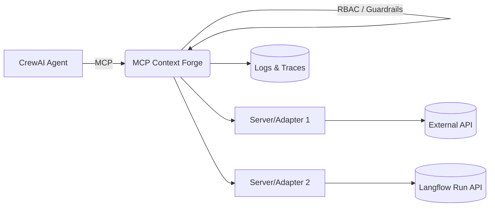

# MCP Context Forge Masterclass

**From Zero to Hero with Agents, Tools, and Enterprise Guardrails**
**Format:** 2 days × (4h Theory AM + 4h Labs PM) = **16 hours**
**Capstone:** Day‑2 builds **CrewAI + Langflow via MCP Context Forge** end‑to‑end

---

## About This Book

This is a pragmatic, Kindle‑ready textbook that blends **concepts**, **reference architecture**, and **hands‑on labs**. It is written for software engineers, platform teams, SRE/DevOps, and AI practitioners who need to move from a blank terminal to a **governed, production‑minded agent stack** using the **Model Context Protocol (MCP) Gateway**.

Every section includes:

* **Narrative** explaining the *why* behind the decisions.
* **Copy‑paste commands** that work on macOS, Linux, and WSL2.
* **Complete Python samples** aligned to the gateway’s APIs.
* **Checklists** and **screenshot call‑outs** for classroom use.

> **Instructor tip**
> If you are time‑boxed, teach from the checklists and run only the **bold** commands in each section. All examples use **port 4444** for the gateway to build reliable muscle memory.

---

## Table of Contents

1. Preface: Why an AI Gateway Now
2. Syllabus: 2‑Day Masterclass at a Glance
3. Part I — Foundations (Day‑1, AM Theory)
   3.1 What is MCP and Why a Gateway
   3.2 Architecture and Core Concepts
   3.3 Agents & Clients Overview
   3.4 Serving Patterns: gRPC, REST, Reverse Proxy, Wrappers
   3.5 Security & Governance Essentials
   3.6 Observability & Telemetry
4. Part II — Hands‑On Labs (Day‑1, PM Labs)
   4.1 Lab 0: Environment Checks
   4.2 Lab 1: Quickstart (Gateway Up + Well‑Known)
   4.3 Lab 2: Register Your First MCP Server
   4.4 Lab 3: Clients & CLI Flows
   4.5 Lab 4: Simple Passthrough / Wrapper
   4.6 Lab 5: Guardrails (Rate Limit)
5. Part III — Capstone Theory (Day‑2, AM Theory)
   5.1 Capstone Overview & Success Criteria
   5.2 Introduction & Architecture: Langflow + CrewAI + Gateway
   5.3 Setup & Prerequisites
   5.4 Designing the Langflow Tool (I/O and API)
   5.5 Exposing Langflow as an MCP Tool Server
   5.6 The CrewAI Agent Pattern
   5.7 Hardening: Guardrails, RBAC, (Optional) OBO, Logs
6. Part IV — Capstone Build (Day‑2, PM Labs)
   6.1 Lab A: Setup & Prereqs
   6.2 Lab B: Build the Langflow Tool
   6.3 Lab C: Expose as MCP Tool Server
   6.4 Lab D: Build the CrewAI Agent
   6.5 Lab E: Guardrails in Action
   6.6 Lab F: RBAC (+ Optional OBO)
   6.7 Lab G: Observability Trace
   6.8 Team Demos & Rubric
7. Appendices
   A. Verified Commands & Config
   B. API Usage Cheatsheet (JWT, health, register tools, list/invoke)
   C. Troubleshooting & FAQ
   D. Screenshot Checklist
   E. Instructor Run‑of‑Show (Minute‑by‑Minute)
   F. Kindle Production Tips

---

## Preface: Why an AI Gateway Now

Agentic AI is exploding: multiple LLMs, tools, plug‑ins, and data sources. Without a **central control plane**, teams face key sprawl, inconsistent security, no audit trail, and repeated integrations. An **MCP Context Forge** fixes this by becoming a **single entry point** where **agents discover and use tools**, while the platform team enforces:

* **Security:** RBAC, OAuth/JWT, optional mTLS.
* **Governance:** PII/Secrets filters, schema guards, rate limits.
* **Observability:** JSON logs and OpenTelemetry traces.

This book is a guided path from **first run** to **production‑grade**—ending with a live capstone: a **CrewAI agent** securely calling a **Langflow** tool **through** the **MCP Context Forge**, with guardrails and logs that prove it.

**What you’ll build and learn**

* Stand up an MCP Context Forge locally (and optionally with Docker Compose).
* Register servers and **federate tools** into a single catalog.
* Wrap Langflow as a **gateway‑managed tool** via a tiny adapter.
* Write a **CrewAI** agent that uses the gateway (not raw services).
* Apply **guardrails** (rate limiters, secret/PII filters, schema guards).
* Enforce role‑based access with **RBAC** and optional **On‑Behalf‑Of (OBO)**.
* Capture **logs & traces** for auditability and cost reporting.

---

## Syllabus: 2‑Day Masterclass at a Glance

**Audience**
Developers, AI engineers, DevOps/SRE, and platform engineers.

**Outcomes**
Run the gateway locally and in a small cluster; federate tools; enforce security and governance; observe traffic; and ship a minimal, rollback‑friendly path to production.

### Day‑1 (AM Theory, 4h) — Foundations to First Value

* Why a gateway, core architecture, agent/client patterns, serving patterns, security & governance, observability.

### Day‑1 (PM Labs, 4h) — From Zero to First Tool

* Quickstart, register a server, use clients, wrap a REST endpoint, enable rate limiting.

### Day‑2 (AM Theory, 4h) — Capstone Design

* Langflow tool design, adapter exposure as MCP tool server, CrewAI agent pattern, hardening plan (guardrails, RBAC/OBO, logs).

### Day‑2 (PM Labs, 4h) — Capstone Build & Demo

* Build flow and adapter, register tool, run CrewAI agent, enable guardrails + RBAC, capture traces, team demos.

---

# Part I — Foundations (Day‑1, AM Theory)

## 3.1 What is MCP and Why a Gateway

**Model Context Protocol (MCP)** standardizes how agents communicate with *tool servers* that expose **tools**, **resources**, and **prompts**. A tool is any callable capability: a database query, a web request, a business system action, or a Langflow flow.

**The MCP Context Forge** sits in front of many MCP servers and REST sources to:

* **Federate tools** into a unified, discoverable catalog.
* **Enforce policy** with plugins (pre/post hooks), RBAC, and authentication.
* **Observe** every call (structured logs + OTEL traces).
* **Abstract transport:** SSE, streamable HTTP, stdio, WebSockets.

**Mental model**

```
Agent ↔ Gateway ↔ MCP Servers / REST APIs
```

The gateway becomes the *policy and routing plane*; agents become simple, policy‑compliant consumers of tools.

**Example — A tool contract (JSON Schema)**

```json
{
  "name": "calc.add",
  "description": "Return a + b",
  "schema": {
    "type": "object",
    "properties": {
      "a": { "type": "number" },
      "b": { "type": "number" }
    },
    "required": ["a", "b"]
  }
}
```

Agents discover this schema via the gateway and can invoke it without learning server‑specific quirks.

---

## 3.2 Architecture and Core Concepts

**Gateway**
Reverse proxy + registry + policy engine. It registers MCP servers (and HTTP adapters), builds a tool catalog, and mediates calls with plugins.

**MCP Server**
A process that exposes tools/resources/prompts using MCP transports (stdio, SSE, etc.). Examples include a calculator, a file‑to‑markdown service, or a Langflow adapter.

**Virtual Servers**
Logical groupings inside the gateway that map to one or more upstreams. Useful for tenancy or environments (e.g., `dev-tools` vs `prod-tools`).

**Plugins**
Middleware executed on **pre** and **post** hooks: rate‑limit, secrets detection, PII filters, schema guards, retry with backoff, etc.

**Auth & RBAC**
Gateway authorizes with JWT/OAuth and enforces **role‑based access control**. Roles can allow specific tools or entire groups.

**Observability**
JSON logs (correlation IDs, latency, policy decisions) and OpenTelemetry traces exported to Phoenix or your APM.

**Diagram (high‑level)**



---

## 3.3 Agents & Clients Overview

**Agents**
CrewAI, LangChain, LangGraph, LlamaIndex, Semantic Kernel, OpenAI SDK. They plan and decide *what tool to call* based on prompts and memory.

**Clients**
MCP CLI, Inspector, IDE clients (Continue, Cline, Claude Desktop), OpenWebUI. These help you explore the tool catalog and test invocations.

**Design pattern**
Point *all* agents and clients at **one** gateway. The gateway remains stable as you add/replace upstream tools.

**Python — Minimal CrewAI with a dummy tool**

```python
from crewai import Agent, Task, Crew

analyst = Agent(
    role="Analyst",
    goal="Summarize inputs concisely",
    backstory="Operates under gateway policies"
)

# A toy task; you’ll replace manual logic with a gateway tool in Day-2
summary_task = Task(
    description="Summarize: {text}",
    expected_output="A 2-3 sentence summary",
    agent=analyst,
)

crew = Crew(agents=[analyst], tasks=[summary_task])
result = crew.kickoff(inputs={"text": "MCP Context Forge centralizes governance for tools."})
print(result)
```

---

## 3.4 Serving Patterns: gRPC, REST, Reverse Proxy, Wrappers

You can expose capabilities to the gateway in multiple ways:

* **Direct MCP** servers (stdio/SSE/WebSocket).
* **Reverse proxy**: forward HTTP while injecting headers/policies.
* **Wrappers/adapters**: translate a REST API into a gateway tool.

**Adapter example (FastAPI) wrapping an upstream HTTP API**

```python
# adapter.py — illustrates the pattern used later for Langflow
from fastapi import FastAPI, HTTPException
import requests

app = FastAPI()
UPSTREAM = "https://httpbin.org/get"

@app.get("/tools")
def tools():
    return {
        "tools": [
            {
                "name": "httpbin.get",
                "schema": {"type": "object", "properties": {"q": {"type": "string"}}}
            }
        ]
    }

@app.post("/call/httpbin.get")
def call(payload: dict):
    try:
        r = requests.get(UPSTREAM, params={"q": payload.get("q", "")}, timeout=10)
        r.raise_for_status()
        return {"status": r.status_code, "json": r.json()}
    except Exception as e:
        raise HTTPException(status_code=502, detail=str(e))
```

This adapter exposes a clean tool contract while hiding upstream quirks.

---

## 3.5 Security & Governance Essentials

Security and governance are not afterthoughts; they’re first‑class *runtime behavior* enforced by the gateway.

**JWT and RBAC**

* Use short‑lived tokens where possible.
* Include a `role` (and optionally `tenant`) claim.
* Authorize at the tool level.

**Example RBAC policy**

```yaml
rbac:
  roles:
    - name: admin
      allow_all: true
    - name: analyst
      allow_tools: ["calc.add", "lf.summarize"]
    - name: viewer
      allow_tools: []
```

**Example — Generate a demo JWT (7 days)**

```bash
export MCPGATEWAY_BEARER_TOKEN=$(python3 -m mcpgateway.utils.create_jwt_token \
  --username admin@example.com --exp 10080 --secret my-test-key)
```

**Guardrails via plugins**

* **Rate limiter**: prevent abuse or cost explosions.
* **Secrets/PII detection**: redact or block sensitive data.
* **Schema guard**: ensure inputs/outputs match the contract.

**Rate limiter (YAML)**

```yaml
plugins:
  - name: rate_limiter
    kind: plugins.rate_limiter.rate_limiter.RateLimiterPlugin
    hooks: ["prompt_pre_fetch", "tool_pre_invoke"]
    mode: enforce
    priority: 50
    config:
      by_user: "60/m"
      by_tenant: "600/m"
      by_tool: "30/m"
      burst: 5
```

**Secrets detection (YAML)**

```yaml
- name: SecretsDetection
  kind: plugins.secrets_detection.secrets_detection.SecretsDetectionPlugin
  hooks: ["prompt_pre_fetch", "tool_post_invoke", "resource_post_fetch"]
  mode: enforce
  priority: 45
  config:
    detectors:
      patterns:
        openai_key: true
        slack_token: true
        private_key_block: true
        jwt_like: true
    redact: true
    redaction_text: "***REDACTED***"
    block_on_detection: true
    min_findings_to_block: 1
```

---

## 3.6 Observability & Telemetry

**Why it matters**
Observability proves correctness, enforces SLOs, and supports audits. You’ll instrument both the gateway and your adapters.

**Log shape (JSON)**

```json
{
  "ts": "2025-03-18T12:34:56.789Z",
  "level": "info",
  "corr_id": "c-2f1a...",
  "tool": "lf.summarize",
  "user": "admin@example.com",
  "latency_ms": 142,
  "policy": {"rate_limit": "ok", "secrets": "ok"},
  "result_size": 512
}
```

**Enable Phoenix (OTEL) for LLM/trace views**

```bash
# Phoenix collector & UI
docker run -p 6006:6006 -p 4317:4317 arizephoenix/phoenix:latest

# Gateway exports traces to Phoenix
export OTEL_ENABLE_OBSERVABILITY=true
export OTEL_TRACES_EXPORTER=otlp
export OTEL_EXPORTER_OTLP_ENDPOINT=http://localhost:4317
mcpgateway --host 0.0.0.0 --port 4444
```

> **Checklist**
>
> * [ ] Correlation/request IDs present in logs
> * [ ] Latency measured at gateway and adapter
> * [ ] Policy decisions recorded (allow/deny/redact)
> * [ ] Traces visible in Phoenix/your APM

---
# Part II — Day‑1 Labs: Quickstart to Guardrails (Storytelling Edition)

Welcome to the afternoon session. The goal is simple and ambitious: get something real running, then layer on structure until it smells like production. We’ll begin with a clean gateway on **port 4444**, add our first tiny server, prove end‑to‑end calls from a client, wrap a public HTTP API, and finally turn on a guardrail that you can feel. The narrative below favors copy‑paste comfort, but pauses to explain *why* each step matters.

---

## 4.2 Lab 1 — Quickstart: Run the Gateway (≈45m)

Picture the gateway as a control tower. Before planes can land, the tower must boot cleanly and answer the radio. That’s what this lab does.

Start in an empty terminal, preferably inside a fresh project folder. Create a virtual environment so today’s packages don’t spill into tomorrow’s projects. Then install the MCP Context Forge and launch it on **4444**.

```bash
# 1) Create venv and install the gateway
python3 -m venv .venv && source .venv/bin/activate
pip install -U mcp-contextforge-gateway

# 2) Launch the gateway on 4444
mcpgateway --host 0.0.0.0 --port 4444
```

Open a second terminal and verify that the tower answers.

```bash
curl -s http://localhost:4444/health | jq .
```

You should see a small JSON object with a status flag. If it’s green, mint yourself a short‑lived badge for the rest of the afternoon: a bearer token embedded in an environment variable.

```bash
export MCPGATEWAY_BEARER_TOKEN=$(python3 -m mcpgateway.utils.create_jwt_token \
  --username admin@example.com --exp 10080 --secret my-test-key)
```

If you already have the **MCP CLI**, ask the tower what tools it knows about. Right now, it’s an empty catalog—exactly what we expect before we register any servers.

```bash
mcp --server http://localhost:4444 tools list
```

**What good looks like**: a healthy JSON from `/health` and an empty tools list. If the port is busy, free it or pick another number, but for muscle memory keep using **4444** today.

**If things go wrong**: best first moves are to check the port, the Python venv activation, and that your `pip install` succeeded. Logs from the gateway process are often plain and helpful.

---

## 4.3 Lab 2 — Register Your First MCP Server (≈45m)

A gateway with no servers is a library without books. Let’s publish our first pamphlet: a tiny calculator server with a single tool, `calc.add`. We’ll write it, run it, and then tell the gateway where to find it.

### 4.3.1 Implement the calculator server

Save the following as `calculator_server.py`. It’s small enough to fit in a slide, yet captures the three essential ideas: advertise tools at `/tools`, implement a tool call under `/call/<tool>`, and return JSON‑shaped results.

```python
# file: calculator_server.py
from fastapi import FastAPI, HTTPException
from pydantic import BaseModel, Field
from typing import Dict, Any
import uvicorn

app = FastAPI(title="Calculator MCP Server")

class AddPayload(BaseModel):
    a: float = Field(..., description="First addend")
    b: float = Field(..., description="Second addend")

@app.get("/tools")
def list_tools() -> Dict[str, Any]:
    """Advertise available tools and their JSON Schemas."""
    return {
        "tools": [
            {
                "name": "calc.add",
                "description": "Add two numbers",
                "schema": {
                    "type": "object",
                    "properties": {
                        "a": {"type": "number"},
                        "b": {"type": "number"}
                    },
                    "required": ["a", "b"]
                }
            }
        ]
    }

@app.post("/call/calc.add")
def call_add(payload: AddPayload) -> Dict[str, Any]:
    try:
        return {"result": payload.a + payload.b}
    except Exception as e:
        raise HTTPException(status_code=400, detail=str(e))

if __name__ == "__main__":
    uvicorn.run(app, host="0.0.0.0", port=9100)
```

Run the server in a second terminal.

```bash
pip install fastapi uvicorn pydantic
python calculator_server.py
```

Give it a quick poke: first the catalog, then the tool itself.

```bash
curl -s http://localhost:9100/tools | jq .

curl -s -X POST http://localhost:9100/call/calc.add \
  -H 'Content-Type: application/json' \
  -d '{"a":2,"b":3}' | jq .
```

You should see `{"result": 5}`. Small wins are still wins.

### 4.3.2 Register the server with the gateway

The gateway needs an entry for this new server: a name, the URL, and the transport mode. We’ll use **STREAMABLEHTTP**, which plays nicely with FastAPI and the HTTP pattern you just built.

```bash
export BASE_URL="http://localhost:4444"
export TOKEN="$MCPGATEWAY_BEARER_TOKEN"

curl -s -X POST -H "Authorization: Bearer $TOKEN" \
  -H "Content-Type: application/json" \
  -d '{
    "name": "calc-server",
    "url": "http://localhost:9100",
    "description": "Calculator MCP server",
    "enabled": true,
    "request_type": "STREAMABLEHTTP"
  }' \
  $BASE_URL/gateways | jq '.'
```

Ask the gateway for its catalog again. This time, it should present the calculator tool it learned from the server you registered.

```bash
curl -s -H "Authorization: Bearer $TOKEN" $BASE_URL/tools | jq '.[] | {name, gateway: .gatewaySlug}'
```

**What good looks like**: a row for `calc.add` associated with your gateway slug. If you don’t see it, confirm the calculator server is still running, that you registered the *base* URL (`http://localhost:9100`), and that `/tools` returns the schema exactly as shown.

---

## 4.4 Lab 3 — Clients & CLI Flows (≈35m)

We’ve built one side of the bridge (the server) and we’ve taught the bridge where it is (registration). Now we’ll walk across it from a client. The **MCP CLI** is minimal and honest—it’s perfect for sanity checking.

From a fresh terminal, invoke the tool through the gateway.

```bash
mcp --server http://localhost:4444 tools list
mcp --server http://localhost:4444 tool call calc.add '{"a":2,"b":3}'
```

Behind the scenes, your call hits the gateway, which fans out to the calculator server and returns the JSON result back to you. If you prefer, you can do the same with `curl` once you know the exact invoke route the gateway exposes for your build. The CLI, however, saves you from memorizing URL shapes.

**What good looks like**: the number **5** returned by the CLI. If the CLI can list tools but not call them, re‑check the JSON you’re sending—it must match the schema the server advertised.

---

## 4.5 Lab 4 — Simple Passthrough / Wrapper (≈35m)

Not every useful system speaks MCP. Wrappers help you treat a plain HTTP API like a first‑class citizen in the gateway catalog. In this lab you’ll wrap `https://httpbin.org/get` as a tool called `httpbin.get`.

Save as `httpbin_wrapper.py`:

```python
# file: httpbin_wrapper.py
from fastapi import FastAPI, HTTPException
import requests

app = FastAPI(title="HTTPBin Wrapper Server")

@app.get("/tools")
def tools():
    return {
        "tools": [
            {
                "name": "httpbin.get",
                "description": "GET https://httpbin.org/get",
                "schema": {"type": "object", "properties": {}, "additionalProperties": False}
            }
        ]
    }

@app.post("/call/httpbin.get")
def call_httpbin():
    try:
        r = requests.get("https://httpbin.org/get", timeout=20)
        r.raise_for_status()
        return r.json()
    except Exception as e:
        raise HTTPException(status_code=502, detail=str(e))
```

Run it just like the calculator (pick another terminal):

```bash
pip install fastapi uvicorn requests
uvicorn httpbin_wrapper:app --port 9200 --host 0.0.0.0
```

Register it with the gateway (note the URL and name):

```bash
curl -s -X POST -H "Authorization: Bearer $TOKEN" \
  -H "Content-Type: application/json" \
  -d '{
    "name": "httpbin-wrapper",
    "url": "http://localhost:9200",
    "description": "Wrapper for httpbin.org",
    "enabled": true,
    "request_type": "STREAMABLEHTTP"
  }' \
  $BASE_URL/gateways | jq '.'
```

List and call through the gateway. Depending on your gateway’s invoke endpoint shape, you can use **MCP CLI** or `curl`—the CLI is friendlier.

```bash
mcp --server http://localhost:4444 tools list
# Then call httpbin.get using the CLI or the gateway's HTTP invoke route.
```

**What good looks like**: a JSON blob from httpbin (headers, origin, URL). You’ve just used the gateway to front a public REST API—exactly the pattern you’ll use in enterprises for legacy services.

---

## 4.6 Lab 5 — Guardrails Intro (≈30m)

Power is only useful with restraint. The gateway’s plugin system lets you enforce guardrails in one place, instead of sprinkling them across services. We’ll start with a rate limiter to make abuse impractical and failure graceful.

Place the following in your gateway configuration where plugins are defined (details vary by deployment, but the shape remains the same). It expresses limits per user, per tenant, and per tool, with a small burst allowance.

```yaml
plugins:
  - name: rate_limiter
    kind: plugins.rate_limiter.rate_limiter.RateLimiterPlugin
    hooks: ["prompt_pre_fetch", "tool_pre_invoke"]
    mode: enforce
    priority: 50
    config:
      by_user: "60/m"
      by_tenant: "600/m"
      by_tool: "30/m"
      burst: 5
```

After reloading the gateway, try to trip the wire. Four calls in quick succession should demonstrate both the 200s and the 429s as the limiter clamps down.

```bash
for i in {1..5}; do
  mcp --server http://localhost:4444 tool call calc.add '{"a":1,"b":1}' || true
done
```

**What good looks like**: the first few calls succeed; a later one returns **429 Too Many Requests**. In the logs, you’ll see the decision annotated with which bucket tripped (by user, by tool, or tenant). This is the first of many guardrails you’ll add tomorrow (secrets detection, PII filters, schema guards), but it’s enough to feel the value: consistent policy, central place, universal effect.

---

### End‑of‑Day Reflection

You now have a gateway that runs, a server that advertises tools, a client that calls them, a wrapper that civilizes a plain HTTP API, and a policy that enforces restraint. That’s a credible foundation. Tomorrow, you’ll turn this into a capstone: expose a **Langflow** flow through an adapter, point a **CrewAI** agent at the gateway, and then layer in RBAC, secrets/PII filters, and tracing so your story is not just fast—it’s *provable*.


---

# Part III — Capstone Theory (Day‑2, AM)

The second morning is where our architecture stops pretending. By lunch you’ll have a working **CrewAI → Gateway → Adapter → Langflow** pipeline that returns real answers, and a plan to keep it safe. Think of today as taking everything from Day‑1 (policies, catalog, clients) and threading them through one compelling story: an agent that never touches raw services, only the **MCP Context Forge**.

---

## 5.1 Capstone Overview & Success Criteria

We are aiming for an **enterprise‑grade path** from an agent to a flow, with governance in the middle. Success is boring and verifiable:

1. The tool is visible in a **single catalog** (the Gateway).
2. A **CrewAI agent** calls that tool **through** the Gateway (never direct to Langflow).
3. Policies **block one call** and **allow another** (a rate‑limit or secrets filter will do).
4. **RBAC** proves its worth with a **200 vs 403**.
5. Logs show **correlation IDs** and **latency**, so ops teams believe the story.

If you can show those five screenshots, you’ve done real platform work.

---

## 5.2 Architecture: Langflow + Adapter + Gateway + CrewAI

Langflow is a friendly canvas. The Gateway is an uncompromising chaperone. The adapter is the interpreter between the two.

```
CrewAI Agent → MCP Context Forge → Adapter/Server → Langflow API → Adapter → Gateway → Agent
```

The Gateway federates tools, authorizes calls, and enforces guardrails. The adapter translates our **Langflow run endpoint** into a **tool** with a crisp JSON schema. The agent only knows one host: the Gateway.

**Why this shape works:**

* We can rotate Langflow or the specific flow ID without changing the agent.
* Policies and RBAC live in one place.
* Observability is consistent: the Gateway sees every call.

---

## 5.3 Setup & Prerequisites

Start with the Gate open and a token in your pocket.

* **Gateway** running on `:4444` and reachable: `curl -s http://localhost:4444/health | jq .`
* A **JWT** in `MCPGATEWAY_BEARER_TOKEN`.
* **Python 3.11+**, a fresh venv, and `pip`.
* **Langflow** and **CrewAI** installed to that venv.
* Optional: Docker for Phoenix (OTEL traces).

> All commands assume a Unix‑like shell; on Windows, use WSL or PowerShell equivalents.

---

## 5.4 Designing the Langflow Tool

Pick a flow you can reason about under pressure. We’ll build a **Summarizer**:

* **Input**: `{ "text": "..." }`
* **Output**: `{ "summary": "...", "usage": {"total_tokens": <int>} }`

Start Langflow and create/identify a flow.

```bash
pip install langflow
langflow run --host 0.0.0.0 --port 7860
```

From the canvas, note your **`<flow_id>`**. Dry‑run the endpoint:

```bash
curl -s -X POST http://localhost:7860/api/v1/run/<flow_id> \
  -H 'Content-Type: application/json' \
  -d '{"text":"MCP Context Forge centralizes tool governance..."}' | jq .
```

You should see a JSON with either a `summary` or an `output` field and, if enabled, a `usage.total_tokens` field. That’s the shape your adapter will normalize.

> If the output format differs, no problem—normalize anything to `{ summary, tokens }` in the adapter.

---

## 5.5 Exposing Langflow as an MCP Tool Server

We’ll publish a single tool, **`lf.summarize`**, with a tiny FastAPI adapter that speaks the Gateway’s language.

### Adapter design notes

* `/tools` advertises the tool list + JSON Schema.
* `/call/<tool>` performs the work. We propagate/emit a **correlation ID** and report latency.
* We keep **timeouts** and the **Langflow URL** in environment variables so ops can tune without code.

### Implementation

```python
# file: langflow_adapter.py
from fastapi import FastAPI, HTTPException, Request
import requests, time, uuid, os, json
from typing import Dict, Any

app = FastAPI(title="Langflow Adapter")

FLOW_URL = os.getenv("LANGFLOW_URL", "http://localhost:7860/api/v1/run/<flow_id>")
TIMEOUT = float(os.getenv("LANGFLOW_TIMEOUT", "60"))

# Simple JSON logger (stdout)
def jlog(**fields):
    print(json.dumps(fields, ensure_ascii=False))

@app.get("/tools")
def tools() -> Dict[str, Any]:
    return {
        "tools": [
            {
                "name": "lf.summarize",
                "description": "Summarize text via Langflow flow",
                "schema": {
                    "type": "object",
                    "properties": {"text": {"type": "string"}},
                    "required": ["text"],
                    "additionalProperties": False
                }
            }
        ]
    }

@app.post("/call/lf.summarize")
def call(payload: Dict[str, Any], request: Request) -> Dict[str, Any]:
    start = time.time()
    corr = request.headers.get("x-correlation-id", str(uuid.uuid4()))
    try:
        # Optional propagation of correlation for downstream visibility
        headers = {"x-correlation-id": corr, "Content-Type": "application/json"}
        r = requests.post(FLOW_URL, json=payload, timeout=TIMEOUT, headers=headers)
        r.raise_for_status()
        data = r.json() if r.content else {}

        normalized = {
            "summary": data.get("summary") or data.get("output") or "",
            "tokens": (data.get("usage") or {}).get("total_tokens", 0),
            "correlation_id": corr,
            "latency_ms": int((time.time() - start) * 1000)
        }
        jlog(event="lf.summarize.ok", corr=corr, latency_ms=normalized["latency_ms"])
        return normalized
    except Exception as e:
        jlog(event="lf.summarize.err", corr=corr, error=str(e))
        raise HTTPException(status_code=502, detail=f"{corr}: {e}")
```

Run it:

```bash
uvicorn langflow_adapter:app --port 9100
```

Register with the Gateway:

```bash
export BASE_URL=http://localhost:4444
export TOKEN=$MCPGATEWAY_BEARER_TOKEN

curl -s -X POST -H "Authorization: Bearer $TOKEN" \
  -H 'Content-Type: application/json' \
  -d '{
    "name": "langflow",
    "url": "http://localhost:9100",
    "description": "Langflow Summarizer",
    "enabled": true,
    "request_type": "STREAMABLEHTTP"
  }' \
  $BASE_URL/gateways | jq '.'
```

Catalog sanity:

```bash
curl -s -H "Authorization: Bearer $TOKEN" $BASE_URL/tools | jq '.[] | {name, gateway: .gatewaySlug}'
```

If `lf.summarize` is present, the adapter contract is good and the Gateway can route to it.

---

## 5.6 The CrewAI Agent Pattern

We’ll show two flavors:

1. A direct HTTP call from the agent module (fastest to demo).
2. A reusable **CrewAI Tool** subclass (cleaner for teams).

### Direct call

```python
# file: crew_agent_direct.py
from crewai import Agent, Task, Crew
import requests

GATEWAY = "http://localhost:4444"
TOOL_NAME = "lf.summarize"

def gateway_invoke(text: str):
    resp = requests.post(f"{GATEWAY}/call/{TOOL_NAME}", json={"text": text}, timeout=60)
    resp.raise_for_status()
    return resp.json()

analyst = Agent(
    role="Analyst",
    goal="Summarize texts using the gateway-managed tool",
    backstory="Operates through the MCP Context Forge only."
)

task = Task(
    description="Summarize the following text",
    expected_output="A concise, accurate summary",
    agent=analyst,
)

crew = Crew(agents=[analyst], tasks=[task])

if __name__ == "__main__":
    result = gateway_invoke("MCP Context Forge centralizes governance for AI tools...")
    print("Summary:", result.get("summary"))
```

### Tool subclass (recommended)

```python
# file: gateway_summarize_tool.py
from crewai.tools import BaseTool
import requests, os

class GatewaySummarizeTool(BaseTool):
    name = "GatewaySummarize"
    description = "Summarize text via Gateway tool lf.summarize"

    def _run(self, text: str) -> str:
        gateway = os.getenv("GATEWAY_URL", "http://localhost:4444")
        token = os.getenv("GATEWAY_TOKEN", "")
        headers = {"Content-Type": "application/json"}
        if token:
            headers["Authorization"] = f"Bearer {token}"
        r = requests.post(f"{gateway}/call/lf.summarize", json={"text": text}, headers=headers, timeout=60)
        r.raise_for_status()
        return (r.json() or {}).get("summary", "")
```

Wire it into an agent:

```python
# file: crew_agent_tool.py
from crewai import Agent, Task, Crew
from gateway_summarize_tool import GatewaySummarizeTool

tool = GatewaySummarizeTool()
agent = Agent(role="Analyst", goal="Use gateway-managed summarization.", tools=[tool])

task = Task(description="Summarize: {text}", expected_output="<=120 words", agent=agent)

if __name__ == "__main__":
    print(Crew(agents=[agent], tasks=[task]).kickoff(inputs={"text": "Your content here..."}))
```

Either path proves the same point: the agent consults one authority (the Gateway), and the Gateway calls the world.

---

## 5.7 Hardening: Guardrails, RBAC, OBO, Logs

* **Guardrails**: start with a **rate limiter** and a **secrets detector**. They catch abuse and mistakes.
* **RBAC**: allow `lf.summarize` only to a role like `analyst`.
* **OBO** (optional): propagate a user identity from your app and authorize at the Gateway.
* **Observability**: JSON logs + OTEL to Phoenix. Prove latency and policy decisions.

You’ll wire these in the afternoon; for now, the design is the important part.

---

# Part IV — Capstone Build (Day‑2, PM Labs)

> The afternoon is for shipping. By the end of these labs you’ll have a Langflow tool powered by **IBM watsonx.ai**, exposed through the **MCP Context Forge**, driven by a **CrewAI agent**, and wrapped with guardrails, RBAC, and traces. Everything routes through the Gateway on **port 4444**.

---

## 6.1 Lab A — Setup & Prereqs (15m)

After lunch, we begin by locking down a clean environment and credentials. Keep your terminal split into two panes: **left** for servers (Gateway, Langflow, adapter) and **right** for commands/tests.

### 1) Environment

```bash
python3 -m venv .venv && source .venv/bin/activate
pip install --upgrade pip
pip install langflow crewai fastapi uvicorn requests pydantic ibm-generative-ai python-dotenv
```

### 2) Gateway (port 4444)

If it isn’t already running from Day‑1:

```bash
pip install mcp-contextforge-gateway
mcpgateway --host 0.0.0.0 --port 4444
```

Generate a bearer token (valid 7 days here):

```bash
export MCPGATEWAY_BEARER_TOKEN=$(python3 -m mcpgateway.utils.create_jwt_token \
  --username admin@example.com --exp 10080 --secret my-test-key)
```

Sanity check:

```bash
curl -s http://localhost:4444/health | jq .
```

### 3) IBM watsonx.ai credentials

Pick your region and export your credentials (adjust to your account):

```bash
export WATSONX_API_KEY="<your-ibm-cloud-api-key>"
export WATSONX_PROJECT_ID="<your-watsonx-project-id>"
export WATSONX_URL="https://us-south.ml.cloud.ibm.com"   # or eu-de, eu-gb, au-syd, jp-tok, ca-tor

# Models (choose ones enabled for your account)
export WATSONX_LLM_MODEL="meta-llama/llama-4-scout-17b-16e-instruct"
export WATSONX_EMBED_MODEL="sentence-transformers/all-minilm-l6-v2"
```

Quick probe to verify your key works (lists embeddings or errors clearly):

```python
# file: sanity_wx_models.py
import os
from genai import Client
from genai.credentials import Credentials

creds = Credentials(api_key=os.environ["WATSONX_API_KEY"], api_endpoint=os.environ["WATSONX_URL"])
client = Client(credentials=creds)
print("OK: watsonx client initialized for:", os.environ["WATSONX_URL"])  # fails loudly if bad
```

Run it:

```bash
python sanity_wx_models.py
```

### 4) Start Langflow (port 7860)

```bash
langflow run --host 0.0.0.0 --port 7860
```

Health check from another terminal:

```bash
curl -s http://localhost:7860/api/v1/health | jq .
```

> **Deliverable**: a working Gateway and a responsive Langflow instance.

---

## 6.2 Lab B — Build the Langflow Tool (40m)

We’ll assemble a single‑purpose **Summarizer** flow that uses your **IBM watsonx.ai** LLM. If you previously installed custom watsonx components (per the earlier chapter or repo `watsonx-langflow-integration`), select them from the Langflow palette. Otherwise, configure your LLM block to call watsonx via your credentials.

### 1) Canvas wiring

1. **Chat Input** → capture user text.

2. **Prompt** → template for summarization:

   ```text
   You are a concise technical writer.
   Summarize the following content in 4–6 sentences, preserving key nouns and acronyms.

   Content:
   {text}
   ```

3. **IBM watsonx.ai LLM** → set endpoint (`WATSONX_URL`), project, API key, and `model_id` = `$WATSONX_LLM_MODEL`.

4. **Chat Output** → display the model’s response.

Wire `Chat Input.value → Prompt.text → LLM.input → Chat Output`.

### 2) Dry‑run from the UI

Type a few paragraphs of text and click **Run**. You should see a clean, compact summary.

### 3) Programmatic test (HTTP)

Copy your **Flow UUID** from Langflow (Export ▸ API). Then test from Python:

```python
# file: probe_langflow.py
import requests
FLOW_ID = "<your-flow-uuid>"
url = f"http://127.0.0.1:7860/api/v1/run/{FLOW_ID}"

payload = {
    "input_value": "MCP Context Forge centralizes tool governance across multiple agents.",
    "input_type": "chat",
    "output_type": "chat"
}
resp = requests.post(url, json=payload, timeout=60)
resp.raise_for_status()

# Langflow’s nested structure; extract the text message safely
j = resp.json()
message = (
  j.get("outputs", [{}])[0]
   .get("outputs", [{}])[0]
   .get("results", {})
   .get("message", {})
   .get("text", "")
)
print("Summary:\n", message)
```

Run it:

```bash
python probe_langflow.py
```

> **Deliverable**: a reproducible Flow UUID and a programmatic proof that it responds.

---

## 6.3 Lab C — Expose as MCP Tool Server (30m)

Now we bridge Langflow into the Gateway with a tiny **adapter**. It advertises a tool named **`lf.summarize`** and forwards calls to your flow’s HTTP endpoint. The Gateway will treat this adapter as an MCP server over **streamable HTTP**.

### 1) Adapter code

```python
# file: langflow_adapter.py
from fastapi import FastAPI, HTTPException, Request
import requests, time, uuid, os
from typing import Dict, Any

app = FastAPI(title="Langflow Adapter")
FLOW_URL = os.getenv("LANGFLOW_URL", "http://localhost:7860/api/v1/run/<flow_id>")
TIMEOUT = float(os.getenv("LANGFLOW_TIMEOUT", "60"))

@app.get("/tools")
def tools() -> Dict[str, Any]:
    return {
        "tools": [
            {
                "name": "lf.summarize",
                "description": "Summarize text via IBM watsonx.ai Langflow flow",
                "schema": {
                    "type": "object",
                    "properties": {"text": {"type": "string"}},
                    "required": ["text"]
                }
            }
        ]
    }

@app.post("/call/lf.summarize")
def call(payload: Dict[str, Any], request: Request) -> Dict[str, Any]:
    start = time.time()
    corr = request.headers.get("x-correlation-id", str(uuid.uuid4()))
    try:
        # Shape request for Langflow
        body = {
            "input_value": payload.get("text", ""),
            "input_type": "chat",
            "output_type": "chat",
        }
        r = requests.post(FLOW_URL, json=body, timeout=TIMEOUT)
        r.raise_for_status()
        data = r.json()
        # Extract nested message text
        msg = (
            data.get("outputs", [{}])[0]
                .get("outputs", [{}])[0]
                .get("results", {})
                .get("message", {})
                .get("text", "")
        )
        return {
            "summary": msg,
            "correlation_id": corr,
            "latency_ms": int((time.time() - start) * 1000)
        }
    except Exception as e:
        raise HTTPException(status_code=502, detail=f"{corr}: {e}")
```

Run the adapter on **port 9100**:

```bash
uvicorn langflow_adapter:app --port 9100
```

### 2) Register with the Gateway

```bash
export BASE_URL=http://localhost:4444
export TOKEN=$MCPGATEWAY_BEARER_TOKEN

curl -s -X POST -H "Authorization: Bearer $TOKEN" \
  -H 'Content-Type: application/json' \
  -d '{
    "name": "langflow",
    "url": "http://localhost:9100",
    "description": "Langflow Summarizer",
    "enabled": true,
    "request_type": "STREAMABLEHTTP"
  }' \
  $BASE_URL/gateways | jq '.'

# Verify the catalog
curl -s -H "Authorization: Bearer $TOKEN" $BASE_URL/tools | jq '.[] | {name, gateway: .gatewaySlug}'
```

> **Deliverable**: `lf.summarize` visible in the Gateway tool catalog.

---

## 6.4 Lab D — Build the CrewAI Agent (35m)

An agent shouldn’t know where tools live. It should only know **the Gateway**. We’ll show two equally valid styles: a quick direct call and a reusable CrewAI **Tool** class.

### A) Direct call helper (fastest to demo)

```python
# file: crew_agent_direct.py
from crewai import Agent, Task, Crew
import requests, os

GATEWAY = os.getenv("GATEWAY_URL", "http://localhost:4444")
TOOL = "lf.summarize"
TOKEN = os.getenv("GATEWAY_TOKEN", "")
HEADERS = {"Content-Type": "application/json"}
if TOKEN:
    HEADERS["Authorization"] = f"Bearer {TOKEN}"

def gateway_summarize(text: str) -> str:
    r = requests.post(f"{GATEWAY}/call/{TOOL}", json={"text": text}, headers=HEADERS, timeout=60)
    r.raise_for_status()
    return r.json().get("summary", "")

analyst = Agent(role="Analyst", goal="Summarize inputs accurately.")

task = Task(
    description="Summarize: {text}",
    expected_output="A crisp 4–6 sentence summary.",
    agent=analyst,
)

crew = Crew(agents=[analyst], tasks=[task])

if __name__ == "__main__":
    print(crew.kickoff(inputs={"text": gateway_summarize("MCP Context Forge centralizes tool governance across agents.")}))
```

### B) CrewAI Tool subclass (production‑friendly)

```python
# file: gateway_summarize_tool.py
from crewai.tools import BaseTool
import os, requests

class GatewaySummarizeTool(BaseTool):
    name = "GatewaySummarize"
    description = "Summarize text via Gateway tool lf.summarize"

    def _run(self, text: str) -> str:
        base = os.getenv("GATEWAY_URL", "http://localhost:4444")
        token = os.getenv("GATEWAY_TOKEN", "")
        headers = {"Content-Type": "application/json"}
        if token:
            headers["Authorization"] = f"Bearer {token}"
        r = requests.post(f"{base}/call/lf.summarize", json={"text": text}, headers=headers, timeout=60)
        r.raise_for_status()
        return (r.json() or {}).get("summary", "")
```

Wire the tool into an agent:

```python
# file: crew_agent_tool.py
from crewai import Agent, Task, Crew
from gateway_summarize_tool import GatewaySummarizeTool

summarize = GatewaySummarizeTool()
agent = Agent(role="Analyst", goal="Use the Gateway for all tools.", tools=[summarize])

task = Task(description="Summarize: {text}", expected_output="<=120 words", agent=agent)

if __name__ == "__main__":
    print(Crew(agents=[agent], tasks=[task]).kickoff(inputs={"text": "Your content here..."}))
```

> **Deliverable**: a CrewAI run that proves the agent never calls Langflow directly—only the Gateway.

---

## 6.5 Lab E — Guardrails in Action (30m)

We’ll enforce a **rate limit** and a basic **secrets detection** pass. Apply these to your Gateway configuration (exact file/flag depends on your deployment). Then trigger both an allowed and a blocked case.

```yaml
# gateway.plugins.yaml (concept)
plugins:
  - name: rate_limiter
    kind: plugins.rate_limiter.rate_limiter.RateLimiterPlugin
    hooks: ["tool_pre_invoke"]
    mode: enforce
    priority: 50
    config:
      by_user: "3/10s"
      by_tool: "3/10s"
      burst: 1

  - name: SecretsDetection
    kind: plugins.secrets_detection.secrets_detection.SecretsDetectionPlugin
    hooks: ["tool_post_invoke"]
    mode: enforce
    priority: 45
    config:
      detectors:
        patterns:
          private_key_block: true
          jwt_like: true
          openai_key: true
      redact: true
      redaction_text: "***REDACTED***"
      block_on_detection: true
      min_findings_to_block: 1
```

Hammer the endpoint to provoke a 429, then send a fake secret to trigger a block/redaction:

```bash
export BASE_URL=http://localhost:4444
export TOKEN=$MCPGATEWAY_BEARER_TOKEN

for i in 1 2 3 4; do
  curl -s -H "Authorization: Bearer $TOKEN" \
    -X POST $BASE_URL/call/lf.summarize \
    -H 'Content-Type: application/json' \
    -d '{"text":"spam me"}' | jq . || true
done

curl -s -H "Authorization: Bearer $TOKEN" \
  -X POST $BASE_URL/call/lf.summarize \
  -H 'Content-Type: application/json' \
  -d '{"text":"sk-live-THIS-IS-FAKE-KEY"}' | jq .
```

> **Deliverable**: screenshots or logs showing one request blocked and one allowed, with clear policy messages.

---

## 6.6 Lab F — RBAC (+ Optional OBO) (30m)

We’ll demonstrate **role‑based access**: analysts can call `lf.summarize`; viewers cannot.

### 1) Sample RBAC policy

```yaml
rbac:
  roles:
    - name: admin
      allow_all: true
    - name: analyst
      allow_tools: ["lf.summarize"]
    - name: viewer
      allow_tools: []
```

### 2) Create role‑scoped tokens

```bash
# Analyst token (allowed)
export ANALYST_TOKEN=$(python3 -m mcpgateway.utils.create_jwt_token \
  --username analyst@example.com --exp 10080 --secret my-test-key \
  --extra '{"role":"analyst"}')

# Viewer token (denied)
export VIEWER_TOKEN=$(python3 -m mcpgateway.utils.create_jwt_token \
  --username viewer@example.com --exp 10080 --secret my-test-key \
  --extra '{"role":"viewer"}')
```

### 3) Exercise the policy

```bash
# Allowed
curl -s -H "Authorization: Bearer $ANALYST_TOKEN" \
  -X POST $BASE_URL/call/lf.summarize \
  -H 'Content-Type: application/json' \
  -d '{"text":"ok"}' | jq .

# Denied (403)
curl -s -H "Authorization: Bearer $VIEWER_TOKEN" \
  -X POST $BASE_URL/call/lf.summarize \
  -H 'Content-Type: application/json' \
  -d '{"text":"deny"}' | jq .
```

> **Optional (OBO)**: in your app, pass a **user JWT** through the agent to the Gateway so authorization is checked per end‑user.

---

## 6.7 Lab G — Observability Trace (20m)

We close with **end‑to‑end traces**. Phoenix makes it easy to visualize spans; the Gateway emits OpenTelemetry if asked nicely.

### 1) Bring up Phoenix

```bash
docker run -p 6006:6006 -p 4317:4317 arizephoenix/phoenix:latest
```

### 2) Enable OTEL on the Gateway and restart it

```bash
export OTEL_ENABLE_OBSERVABILITY=true
export OTEL_TRACES_EXPORTER=otlp
export OTEL_EXPORTER_OTLP_ENDPOINT=http://localhost:4317
mcpgateway --host 0.0.0.0 --port 4444
```

### 3) Send a request with a correlation ID

```python
# file: trace_probe.py
import requests, uuid, os
base = os.getenv("GATEWAY_URL", "http://localhost:4444")
headers = {"Content-Type": "application/json", "x-correlation-id": str(uuid.uuid4())}
token = os.getenv("GATEWAY_TOKEN", "")
if token:
    headers["Authorization"] = f"Bearer {token}"

r = requests.post(f"{base}/call/lf.summarize", json={"text": "trace me"}, headers=headers, timeout=60)
r.raise_for_status()
print(r.json())
```

Run it and then open **[http://localhost:6006](http://localhost:6006)** to inspect the span timeline and attributes. You should see your correlation ID threaded through.

> **Deliverable**: a screenshot of Phoenix showing a request span with latency and correlation ID.

---

## 6.8 Team Demos & Rubric (20–30m)

Each team now presents a short, operator‑grade demo. Tell the story from the perspective of a platform owner and an app team:

1. **Discovery** — Open the Gateway catalog and show `lf.summarize` registered via the adapter.
2. **Agent run** — Show your CrewAI script producing a summary. Reiterate: the agent knows only the **Gateway**.
3. **Guardrails** — Trigger a rate‑limit 429, then a normal 200. Explain your thresholds.
4. **RBAC** — One allowed call with the **analyst** token; one denied with **viewer**.
5. **Trace** — Show a Phoenix span containing your correlation ID and latency.

Close with a one‑liner: *“We can add or swap tools behind the Gateway without changing any agent code. Security, policy, and logs live in one place.”*

---

### Appendix: Quick file layout (what you built today)

```
capstone/
├── crew_agent_direct.py
├── crew_agent_tool.py
├── gateway_summarize_tool.py
├── langflow_adapter.py
├── probe_langflow.py
├── sanity_wx_models.py
└── trace_probe.py
```

> Keep this folder in your repo. It’s a minimal, reproducible path from **flow** → **adapter** → **gateway** → **agent** → **policy** → **trace**.


---

# Appendices

# Appendix A — Building a Multimodal RAG Chatbot with **Docling** + **IBM watsonx.ai** via the **MCP Context Forge**

*Editorial integration note.* With this appendix added, all previous appendices shift by one letter: what was **Appendix A** is now **Appendix B**, **B → C**, … through the end of the book. Cross‑references in the manuscript should be updated accordingly in the next editing pass.

---

## Why this appendix exists

Day‑2 of the masterclass ends with a governed path from agent to tool through the MCP Context Forge. Many teams then ask, “How do we make this work on our document pile — PDFs, Office files, scanned images — without drowning in extraction noise?” This appendix answers that question. You will parse messy documents with **Docling**, embed them with **IBM watsonx.ai**, index them in **ChromaDB**, and expose three simple MCP tools behind the **Gateway**. A tiny chat client and an optional CrewAI agent will talk only to the Gateway, keeping security, RBAC, and observability in one place.

By the end, you will have a production‑minded pattern you can extend: Docling for high‑quality parsing, watsonx.ai for enterprise LLMs and embeddings, a vector store you control, and the Gateway as your control plane.

---

## Prerequisites

You should have the MCP Context Forge running on **port 4444** with a bearer token from the main book’s quickstart. Your Python runtime should be 3.11 or newer. For cloud model access, you’ll need an IBM Cloud account with **watsonx.ai** enabled, an **API key**, a **Project ID**, and a regional **endpoint** (for example, `https://us-south.ml.cloud.ibm.com`). If you don’t have cloud access yet, this appendix includes a local embedding fallback so you can still validate the pipeline end‑to‑end.

---

## 1) Environment setup

Create an isolated virtual environment and install the small set of libraries we’ll use. Keep this shell open for the rest of the appendix.

```bash
python3 -m venv .venv && source .venv/bin/activate
pip install --upgrade pip
# Core web + data pieces
pip install fastapi uvicorn pydantic chromadb requests python-multipart
# Docling for robust document parsing
pip install docling
# IBM watsonx.ai SDK (a.k.a. genai)
pip install ibm-generative-ai
# Optional: local embeddings so you can develop without cloud access
pip install sentence-transformers
```

Export your IBM credentials; these can also live in a `.env` you load in Python. The model names below are examples — pick any supported models for your account.

```bash
export WATSONX_API_KEY="<your-ibm-cloud-api-key>"
export WATSONX_PROJECT_ID="<your-watsonx-project-id>"
export WATSONX_URL="https://us-south.ml.cloud.ibm.com"   # choose your region
export WATSONX_EMBED_MODEL="sentence-transformers/all-minilm-l6-v2"
export WATSONX_LLM_MODEL="meta-llama/llama-4-scout-17b-16e-instruct"
```

If you want to run without cloud calls while you iterate, set a single flag:

```bash
export USE_LOCAL_EMBEDDINGS=1
```

---

## 2) The Docling MCP server

The server below is deliberately small. It offers three MCP‑style tools:

* `docling.parse` to turn one uploaded file into clean text (and optional base64 images).
* `docling.ingest` to parse and chunk many files, embed with watsonx.ai (or local fallback), and upsert into **ChromaDB**.
* `docling.query` to retrieve relevant chunks and generate an answer with the watsonx.ai LLM.

All calls log a correlation ID and a latency so the Gateway and your observability stack can stitch the story together.

Create `docling_mcp_server.py` and paste the code in full.

```python
# file: docling_mcp_server.py
from fastapi import FastAPI, HTTPException, UploadFile, File, Form, Request
from pydantic import BaseModel, Field
from typing import Dict, Any, List, Optional
import os, io, time, uuid, base64, json
import chromadb
from chromadb.utils import embedding_functions

# --- Docling imports ---
from docling.document_converter import DocumentConverter
from docling.datamodel.base_models import ConversionResult

# --- IBM watsonx.ai (genai) ---
USE_LOCAL_EMBEDDINGS = bool(int(os.getenv("USE_LOCAL_EMBEDDINGS", "0")))
try:
    from genai import Client
    from genai.credentials import Credentials
    from genai.schema import TextGenerationParameters, TextEmbeddingParameters
    HAVE_WX = True
except Exception:
    HAVE_WX = False

app = FastAPI(title="Docling MCP Server")

# ---- Settings ----
WATSONX_API_KEY = os.getenv("WATSONX_API_KEY", "")
WATSONX_PROJECT_ID = os.getenv("WATSONX_PROJECT_ID", "")
WATSONX_URL = os.getenv("WATSONX_URL", "https://us-south.ml.cloud.ibm.com")
WATSONX_EMBED_MODEL = os.getenv("WATSONX_EMBED_MODEL", "sentence-transformers/all-minilm-l6-v2")
WATSONX_LLM_MODEL = os.getenv("WATSONX_LLM_MODEL", "meta-llama/llama-4-scout-17b-16e-instruct")

CHROMA_DIR = os.getenv("CHROMA_DIR", "")  # if set, persist the DB
COLLECTION_NAME = os.getenv("DOC_COLLECTION", "docling_rag")

# ---- Vector store ----
if CHROMA_DIR:
    client = chromadb.PersistentClient(path=CHROMA_DIR)
else:
    client = chromadb.Client()

collection = client.get_or_create_collection(name=COLLECTION_NAME)

# ---- Embeddings ----

# Local fallback embedding function
local_embedder = embedding_functions.SentenceTransformerEmbeddingFunction(
    model_name="sentence-transformers/all-MiniLM-L6-v2"
)

# Watsonx client (if available)
wx_client = None
if HAVE_WX and WATSONX_API_KEY and not USE_LOCAL_EMBEDDINGS:
    try:
        creds = Credentials(api_key=WATSONX_API_KEY, api_endpoint=WATSONX_URL)
        wx_client = Client(credentials=creds)
    except Exception as e:
        print({"event": "warn", "msg": f"Failed to init watsonx client: {e}"})


def embed_texts(texts: List[str]) -> List[List[float]]:
    """Return embeddings using watsonx if configured, otherwise local model."""
    if wx_client and not USE_LOCAL_EMBEDDINGS:
        params = TextEmbeddingParameters()  # defaults are OK for common models
        out = wx_client.embeddings.create(
            model_id=WATSONX_EMBED_MODEL,
            input=texts,
            parameters=params,
            project_id=WATSONX_PROJECT_ID,
        )
        vectors = []
        for item in out.results:  # type: ignore[attr-defined]
            vectors.append(item.embedding)
        return vectors
    return local_embedder(texts)


def generate_answer(prompt: str, max_new_tokens: int = 512, temperature: float = 0.2) -> str:
    if wx_client:
        params = TextGenerationParameters(
            decoding_method="greedy",
            max_new_tokens=max_new_tokens,
            temperature=temperature,
        )
        resp = wx_client.text.generation.create(
            model_id=WATSONX_LLM_MODEL,
            input=prompt,
            parameters=params,
            project_id=WATSONX_PROJECT_ID,
        )
        try:
            return resp.results[0].generated_text  # type: ignore[attr-defined]
        except Exception:
            return json.dumps(resp.dict() if hasattr(resp, "dict") else str(resp))
    return "[LLM not configured] Provide WATSONX_API_KEY / PROJECT / URL."


# ---- Schemas ----
class QueryPayload(BaseModel):
    query: str = Field(..., description="User question")
    k: int = Field(4, description="Top K for retrieval")


# ---- Tools endpoint ----
@app.get("/tools")
def tools() -> Dict[str, Any]:
    return {
        "tools": [
            {
                "name": "docling.parse",
                "description": "Parse a single PDF/image and return extracted text (and base64 images).",
                "schema": {
                    "type": "object",
                    "properties": {
                        "return_images": {"type": "boolean", "default": False}
                    },
                    "required": []
                }
            },
            {
                "name": "docling.ingest",
                "description": "Parse & ingest one or more PDFs/images into the vector index.",
                "schema": {
                    "type": "object",
                    "properties": {
                        "metas": {"type": "object", "description": "Optional metadata dict to attach to all docs."}
                    },
                    "required": []
                }
            },
            {
                "name": "docling.query",
                "description": "RAG query over ingested documents using watsonx LLM.",
                "schema": {
                    "type": "object",
                    "properties": {
                        "query": {"type": "string"},
                        "k": {"type": "integer", "default": 4}
                    },
                    "required": ["query"]
                }
            }
        ]
    }


# ---- Parse tool ----
@app.post("/call/docling.parse")
async def call_parse(request: Request, return_images: bool = Form(False), file: UploadFile = File(...)) -> Dict[str, Any]:
    started = time.time(); corr = request.headers.get("x-correlation-id", str(uuid.uuid4()))
    try:
        content = await file.read()
        converter = DocumentConverter()
        result: ConversionResult = converter.convert(io.BytesIO(content), file.filename)

        text = result.document.export_to_markdown()  # readable text
        images_out: List[str] = []
        if return_images and result.images:
            for img in result.images:
                buf = io.BytesIO()
                img.pil_image.save(buf, format="PNG")
                images_out.append(base64.b64encode(buf.getvalue()).decode("utf-8"))

        payload = {
            "text": text,
            "images": images_out,
            "filename": file.filename,
            "latency_ms": int(1000 * (time.time() - started)),
            "correlation_id": corr,
        }
        print({"event": "docling.parse", "corr": corr, "latency_ms": payload["latency_ms"], "file": file.filename})
        return payload
    except Exception as e:
        print({"event": "error", "tool": "docling.parse", "corr": corr, "error": str(e)})
        raise HTTPException(status_code=400, detail=f"{corr}: {e}")


# ---- Ingest tool ----
@app.post("/call/docling.ingest")
async def call_ingest(request: Request, metas: Optional[str] = Form(None), files: List[UploadFile] = File(...)) -> Dict[str, Any]:
    """Ingest multiple files: parse -> chunk -> embed -> upsert into ChromaDB."""
    started = time.time(); corr = request.headers.get("x-correlation-id", str(uuid.uuid4()))
    try:
        meta_common = json.loads(metas) if metas else {}
        converter = DocumentConverter()
        texts, ids, metadatas = [], [], []
        for f in files:
            content = await f.read()
            result = converter.convert(io.BytesIO(content), f.filename)
            text = result.document.export_to_markdown()
            # naive chunking; Docling preserves headings—use them if you want smarter chunks
            chunks = [text[i:i+1200] for i in range(0, len(text), 1000)]
            for idx, ch in enumerate(chunks):
                texts.append(ch)
                ids.append(f"{f.filename}:{idx}")
                md = {"source": f.filename, **meta_common}
                metadatas.append(md)

        vectors = embed_texts(texts)
        collection.upsert(documents=texts, embeddings=vectors, ids=ids, metadatas=metadatas)
        payload = {
            "ingested_docs": len(set([m["source"] for m in metadatas])),
            "chunks": len(texts),
            "latency_ms": int(1000 * (time.time() - started)),
            "correlation_id": corr,
        }
        print({"event": "docling.ingest", "corr": corr, "chunks": payload["chunks"], "latency_ms": payload["latency_ms"]})
        return payload
    except Exception as e:
        print({"event": "error", "tool": "docling.ingest", "corr": corr, "error": str(e)})
        raise HTTPException(status_code=400, detail=f"{corr}: {e}")


# ---- Query tool ----
@app.post("/call/docling.query")
async def call_query(payload: QueryPayload, request: Request) -> Dict[str, Any]:
    started = time.time(); corr = request.headers.get("x-correlation-id", str(uuid.uuid4()))
    try:
        # Retrieve
        qvec = embed_texts([payload.query])[0]
        res = collection.query(query_embeddings=[qvec], n_results=payload.k)
        docs = res.get("documents", [[]])[0]
        metas = res.get("metadatas", [[]])[0]

        # Build prompt
        context = "\n\n".join(docs[: payload.k])
        prompt = (
            "You are a helpful assistant. Use the context to answer the question.\n"
            "If unsure, say you don’t know.\n\n"
            f"Context:\n{context}\n\n"
            f"Question: {payload.query}\n"
            "Answer:"
        )
        answer = generate_answer(prompt)

        payload_out = {
            "answer": answer,
            "sources": metas[: payload.k],
            "latency_ms": int(1000 * (time.time() - started)),
            "correlation_id": corr,
        }
        print({"event": "docling.query", "corr": corr, "latency_ms": payload_out["latency_ms"], "k": payload.k})
        return payload_out
    except Exception as e:
        print({"event": "error", "tool": "docling.query", "corr": corr, "error": str(e)})
        raise HTTPException(status_code=400, detail=f"{corr}: {e}")


if __name__ == "__main__":
    import uvicorn
    uvicorn.run(app, host="0.0.0.0", port=9200)
```

Start the server and keep it running while you test:

```bash
uvicorn docling_mcp_server:app --port 9200
```

A quick smoke test is worth doing before you involve the Gateway. Try each tool once.

```bash
# Parse one file
curl -s -F return_images=false -F file=@/path/to/your.pdf \
  http://localhost:9200/call/docling.parse | jq '.text | length'

# Ingest many files at once
curl -s -F files=@/path/to/one.pdf -F files=@/path/to/two.pdf \
     -F metas='{"tenant":"acme"}' \
     http://localhost:9200/call/docling.ingest | jq .

# Query across the index
curl -s -H 'Content-Type: application/json' \
  -d '{"query":"What is the refund policy?","k":4}' \
  http://localhost:9200/call/docling.query | jq .
```

---

## 3) Register the Docling server with the Gateway

Once you’re confident locally, tell the Gateway where to find your new MCP server so the tools appear in the global catalog. Authenticate with the same token you generated earlier in the book.

```bash
export BASE_URL=http://localhost:4444
export TOKEN=$MCPGATEWAY_BEARER_TOKEN

curl -s -X POST -H "Authorization: Bearer $TOKEN" \
  -H 'Content-Type: application/json' \
  -d '{
    "name": "docling",
    "url": "http://localhost:9200",
    "description": "Docling RAG Server",
    "enabled": true,
    "request_type": "STREAMABLEHTTP"
  }' \
  $BASE_URL/gateways | jq '.'

# Verify the catalog
curl -s -H "Authorization: Bearer $TOKEN" $BASE_URL/tools | jq '.[] | {name, gateway: .gatewaySlug}'
```

You should now see `docling.parse`, `docling.ingest`, and `docling.query` advertised by the `docling` server. From this point onward your clients and agents call the Gateway — not the Docling service directly.

---

## 4) Multimodal notes

Scanned pages and embedded figures are first‑class citizens for Docling. If you pass `return_images=true` to `docling.parse`, the service returns small base64‑encoded PNGs alongside the text. This is useful for human review in a UI, for attaching previews into support tickets, or for chaining into OCR or captioning before re‑ingestion. If you need explicit OCR, add a lightweight OCR step, keep the Gateway in front of it, and let your secrets/PII plugins inspect the content before it reaches the vector store.

---

## 5) A tiny chat client (Gateway‑only)

The following module keeps your application honest: it never speaks to Docling. It calls one endpoint on the Gateway, bringing along whatever identity and policy you configured in production.

Create `chat_rag_client.py`.

```python
# file: chat_rag_client.py
import os, requests

BASE_URL = os.getenv("GATEWAY_URL", "http://localhost:4444")
TOKEN = os.getenv("GATEWAY_TOKEN", "")
HEADERS = {"Content-Type": "application/json"}
if TOKEN:
    HEADERS["Authorization"] = f"Bearer {TOKEN}"

def ask(query: str, k: int = 4):
    url = f"{BASE_URL}/call/docling.query"
    r = requests.post(url, json={"query": query, "k": k}, headers=HEADERS, timeout=60)
    r.raise_for_status()
    return r.json()

if __name__ == "__main__":
    resp = ask("Summarize our SOW termination clause.")
    print("\nAnswer:\n", resp.get("answer"))
    print("\nSources:", resp.get("sources"))
```

Run it with your Gateway URL and token.

```bash
export GATEWAY_URL=http://localhost:4444
export GATEWAY_TOKEN=$MCPGATEWAY_BEARER_TOKEN
python chat_rag_client.py
```

---

## 6) Optional: a CrewAI agent that uses the Gateway tool

For teams leaning into agents, here’s a minimal CrewAI composition that wraps the same Gateway call as a Tool. Copy it into `crew_agent_docling.py`.

```python
# file: crew_agent_docling.py
from crewai import Agent, Task, Crew
from crewai.tools import BaseTool
import os, requests

class GatewayRAGTool(BaseTool):
    name = "GatewayRAG"
    description = "Answer questions over ingested documents via docling.query"
    def _run(self, question: str) -> str:
        base = os.getenv("GATEWAY_URL", "http://localhost:4444")
        token = os.getenv("GATEWAY_TOKEN", "")
        headers = {"Content-Type": "application/json"}
        if token:
            headers["Authorization"] = f"Bearer {token}"
        r = requests.post(f"{base}/call/docling.query", json={"query": question, "k": 4}, headers=headers, timeout=60)
        r.raise_for_status()
        return r.json().get("answer", "")

rag_tool = GatewayRAGTool()
analyst = Agent(role="Analyst", goal="Answer contract questions accurately.", tools=[rag_tool])

task = Task(description="Q&A: {question}", expected_output="A precise, cited answer.", agent=analyst)

if __name__ == "__main__":
    print(Crew(agents=[analyst], tasks=[task]).kickoff(inputs={"question": "What’s our renewal window?"}))
```

The value here isn’t the agent’s theatrics — it’s the discipline of calling **only** through the Gateway, so your guardrails and identity policies remain consistent whether a person or an agent is asking the question.

---

## 7) Guardrails, RBAC, and observability

Because you registered the Docling server with the Gateway, all the policy you configured earlier applies immediately. If you want a small, concrete set while prototyping, start with this:

```yaml
plugins:
  - name: rate_limiter
    kind: plugins.rate_limiter.rate_limiter.RateLimiterPlugin
    hooks: ["tool_pre_invoke"]
    mode: enforce
    priority: 50
    config:
      by_user: "30/m"
      by_tool: "60/m"
      burst: 5

  - name: SecretsDetection
    kind: plugins.secrets_detection.secrets_detection.SecretsDetectionPlugin
    hooks: ["tool_post_invoke"]
    mode: enforce
    priority: 45
    config:
      detectors:
        patterns:
          private_key_block: true
          jwt_like: true
          openai_key: true
      redact: true
      redaction_text: "***REDACTED***"
      block_on_detection: true
      min_findings_to_block: 1

rbac:
  roles:
    - name: analyst
      allow_tools: ["docling.query", "docling.ingest", "docling.parse"]
    - name: viewer
      allow_tools: ["docling.query"]
```

For observability, set the OTEL environment variables from the main book and run Phoenix. The server prints correlation IDs and latencies; the Gateway attaches its own request IDs and plugin decisions. Together, you get an end‑to‑end trace that reads like a flight recorder.

---

## 8) End‑to‑end checklist

Before you celebrate, confirm the basics: the Gateway is healthy on port 4444; the Docling service is listening on 9200; the `docling` tools appear in the catalog; ingestion returns more than zero chunks; `docling.query` returns an answer with sources; the optional CrewAI agent produces a grounded response; one call is allowed and one is blocked by policy; and Phoenix shows at least one coherent trace from client to tool and back.

---

## 9) Troubleshooting

If the IBM SDK import fails, you may have an older package set. This appendix uses the `ibm-generative-ai` SDK imported as `genai`. Adjust imports to match your installed version or reinstall from a clean virtual environment. If `docling.query` returns an empty answer, check that ingestion produced chunks and that your embedding model is accessible. For large PDFs, increase the chunk size or overlap; Docling preserves headings, so a heading‑aware chunker is a smart next step. If you requested images but none appeared, set `return_images=true` on `docling.parse` and verify that your client decodes base64 PNGs. During local development, set `USE_LOCAL_EMBEDDINGS=1` to avoid cloud calls until the pipeline behaves.

---

## 10) Where to go next

Swap ChromaDB for a managed vector store when you need durability and scale. Attach tenant metadata during `docling.ingest` and filter queries per role for document‑level RBAC. Stream watsonx.ai tokens through the Gateway’s streamable HTTP mode if your UI prefers incremental updates. Finally, format citations in the response by transforming the `sources` metadata into Markdown footnotes for reports and audits.

> You now have a governed, multimodal RAG spine: **Docling → watsonx.ai → Gateway → Agent/Client**. The Gateway remains your single point of policy, identity, and observability — the difference between a demo and a dependable system.


## Appendix B — Verified Commands & Config

Install & launch (PyPI):

```bash
pip install mcp-contextforge-gateway
mcpgateway --host 0.0.0.0 --port 4444
curl -s http://localhost:4444/health | jq .
```

Generate a bearer token:

```bash
export MCPGATEWAY_BEARER_TOKEN=$(python3 -m mcpgateway.utils.create_jwt_token \
  --username admin@example.com --exp 10080 --secret my-test-key)
```

Well-Known examples:

```bash
export WELL_KNOWN_ROBOTS_TXT=$'User-agent: *\nDisallow: /'
export WELL_KNOWN_SECURITY_TXT=$'Contact: security@example.com\nEncryption: https://example.com/pgp\nExpires: 2025-12-31T23:59:59Z'
export WELL_KNOWN_CUSTOM_FILES='{"ai.txt":"AI is used for tool orchestration"}'
export WELL_KNOWN_CACHE_MAX_AGE=7200
```

Observability + Phoenix:

```bash
export OTEL_ENABLE_OBSERVABILITY=true
export OTEL_TRACES_EXPORTER=otlp
export OTEL_EXPORTER_OTLP_ENDPOINT=http://localhost:4317
docker run -p 6006:6006 -p 4317:4317 arizephoenix/phoenix:latest
mcpgateway
```

Wrapper & Bridge utilities (where available):

```bash
python -m mcpgateway.wrapper --gatewayBaseUrl http://localhost:4444 --token "$MCPGATEWAY_BEARER_TOKEN"

python -m mcpgateway.translate \
  --mode stdio-to-sse \
  --sseBaseUrl http://localhost:4444 \
  --token "$MCPGATEWAY_BEARER_TOKEN"
```

MCP CLI quickies:

```bash
mcp --server http://localhost:4444 tools list
mcp --server http://localhost:4444 tool call calc.add '{"a":2,"b":3}'
mcp --server http://localhost:4444 /save session.json
```

---

## Appendix C — API Usage Cheatsheet

```bash
# Base URLs
export BASE_URL="http://localhost:4444"
export TOKEN="$MCPGATEWAY_BEARER_TOKEN"

# Health
curl -s $BASE_URL/health | jq '.'

# Register MCP server
curl -s -X POST -H "Authorization: Bearer $TOKEN" \
  -H "Content-Type: application/json" \
  -d '{
    "name": "my-mcp-server",
    "url": "http://localhost:9000",
    "description": "My custom MCP server",
    "enabled": true,
    "request_type": "STREAMABLEHTTP"
  }' \
  $BASE_URL/gateways | jq '.'

# List tools
curl -s -H "Authorization: Bearer $TOKEN" \
  $BASE_URL/tools | jq '.[] | {name: .name, gateway: .gatewaySlug}'
```

> Some builds use `/tools/<tool-id>/invoke` instead of `/call/<name>`. Inspect tool details and adjust.

---

## Appendix D — Troubleshooting & FAQ

* **502 from gateway** → Adapter URL/port mismatch; fix and retry.
* **Tool missing** → Adapter’s `/tools` must return valid JSON; check Gateway logs.
* **CORS in UI** → Set allowed origins; use CLI while fixing UI.
* **Rate limiter not firing** → Lower thresholds/window; ensure plugin is enabled.
* **RBAC not applying** → Confirm JWT contains proper role claims; reload config.

---

## Appendix E — Screenshot Checklist

* Health JSON
* Tool catalog (after registration)
* Client call (CLI)
* Client call (UI)
* 429 rate-limit block
* Redaction log
* 200/403 RBAC proof
* Trace with correlation ID

---

## Appendix F — Instructor Run-of-Show (Minute-by-Minute)

**Day-1 AM — Theory (4h) — Foundations**

| Time | Segment | Cues & Expected State |
| --- | --- | --- |
| 09:00–09:10 | Welcome & goals | Outcomes, repo map, docs open |
| 09:10–09:30 | 3.1 What is MCP and Why a Gateway | Pain points; UI concepts; value |
| 09:30–10:20 | 3.2 Architecture and Core Concepts | Flow; plugin hooks; multitenancy |
| 10:20–10:30 | Break | — |
| 10:30–11:35 | 3.3 Agents & Clients Overview | CrewAI vs LangGraph; Demo MCP CLI |
| 11:35–12:10 | 3.4 Serving Patterns: gRPC, REST, Wrappers | curl passthrough demo |
| 12:10–12:20 | Break | — |
| 12:20–12:50 | 3.5 Security & Governance Essentials | RBAC, OAuth/mTLS, teams |
| 12:50–13:00 | 3.6 Observability & Telemetry | Log fields & IDs; OpenTelemetry |

**Day-1 PM — Labs (4h) — From Zero to First Tool**

| Time | Segment | Cues | Outputs |
| --- | --- | --- | --- |
| 14:00–14:20 | 4.1 Lab 0: Environment Checks | Verify env; unblock ports | Checklist complete |
| 14:20–15:05 | 4.2 Lab 1: Quickstart (Gateway Up + Well‑Known) | mcpgateway up; `/health` | Health + tools screenshots |
| 15:05–15:15 | Break | — | — |
| 15:15–16:00 | 4.3 Lab 2: Register Your First MCP Server | Register server; invoke | Tool appears; valid output |
| 16:00–16:35 | 4.4 Lab 3: Clients & CLI Flows | Two clients call same tool | 2 screenshots |
| 16:35–16:45 | Break | — | — |
| 16:45–17:20 | 4.5 Lab 4: Simple Passthrough / Wrapper | Wrapper/passthrough demo | JSON response |
| 17:20–18:00 | 4.6 Lab 5: Guardrails (Rate Limit) | Enable rate limit; show 429 | 429 + 200 proofs |

**Day-2 AM — Theory (4h) — Capstone Design**

| Time | Segment | Cues | State |
| --- | --- | --- | --- |
| 09:00–09:10 | 5.1 Capstone Overview & Success Criteria | Success checklist | Clear target |
| 09:10–09:25 | 5.2 Introduction & Architecture | Diagram Langflow↔Adapter↔Gateway↔Agent | Shared model |
| 09:25–09:40 | 5.3 Setup & Prerequisites | Dry-run commands | Ready to start |
| 09:40–10:20 | 5.4 Designing the Langflow Tool (I/O and API) | Define I/O schema; talk latency | Flow chosen |
| 10:20–10:30 | Break | — | — |
| 10:30–11:10 | 5.5 Exposing Langflow as an MCP Tool Server | Show adapter skeleton & registration | Endpoints known |
| 11:10–12:00 | 5.6 The CrewAI Agent Pattern | Minimal code; invoke via gateway | Code plan ready |
| 12:00–12:10 | Break | — | — |
| 12:10–12:50 | 5.7 Hardening: Guardrails, RBAC, (OBO), Logs | Pick policies + RBAC; optional OBO | Acceptance plan |
| 12:50–13:00 | Q&A | Clarify open items | Confidence high |

**Day-2 PM — Labs (4h) — Capstone Build**

| Time | Segment | Cues | Outputs |
| --- | --- | --- | --- |
| 14:00–14:15 | 6.1 Lab A: Setup & Prereqs | Compose up; venv; install deps | Ready checklist |
| 14:15–14:55 | 6.2 Lab B: Build the Langflow Tool | Endpoint responds | Sample JSON |
| 14:55–15:25 | 6.3 Lab C: Expose as MCP Tool Server | Register adapter; catalog visible | Tool + CLI proof |
| 15:25–15:35 | Break | — | — |
| 15:35–16:10 | 6.4 Lab D: Build the CrewAI Agent | Run agent; confirm tool call | Agent output |
| 16:10–16:40 | 6.5 Lab E: Guardrails in Action | Show 429 + redaction | Policy proofs |
| 16:40–16:50 | Break | — | — |
| 16:50–17:20 | 6.6 Lab F: RBAC (+ Optional OBO) | 200 vs 403; optional OBO | Authz + logs |
| 17:20–17:40 | 6.7 Lab G: Observability Trace | Correlation ID + latency | 3-line trace |
| 17:40–18:00 | 6.8 Team Demos & Rubric | 3–4 min/team; rubric scoring | All proofs in |
---

## Appendix G — Kindle Production Tips

* Use fenced code blocks with language hints (`bash`, `python`, `yaml`)
* Prefer short, single-column tables; avoid wide layouts
* Keep screenshots ≤ **1200 px** wide and name consistently (`NN_topic.png`)
* Split large chapters with H2/H3 for easy navigation
* Include the ToC as front matter—KDP will pick up section headings automatically

---

## Acknowledgments

With gratitude to the **IBM** community and teams who make this work possible. Special thanks to **Mihai Criveti** for core architectural contributions, **Ruchir Puri** for the constant push to innovate, and **Peter Staar** for leadership around Docling. Appreciation to the **IBM Client Innovation Center**—in particular **Gaetano Scioscia**—for guidance on pragmatic innovation and steadfast support of our clients.

*Prepared for the **MCP Context Forge Masterclass** community. Adapt, extend, and remix under your repository’s license.*å€