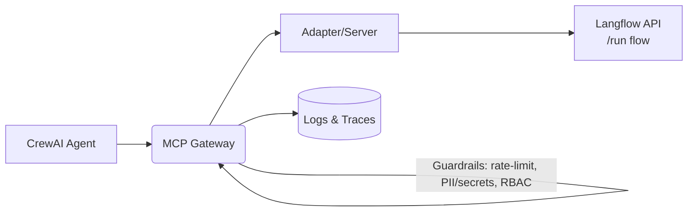

<p align="center">
  <a href="https://www.python.org" target="_blank" rel="noopener">
    
  </a>
  <a href="https://fastapi.tiangolo.com" target="_blank" rel="noopener">
    
  </a>
  <a href="https://squidfunk.github.io/mkdocs-material/" target="_blank" rel="noopener">
    
  </a>
</p>

---

## Welcome

The **MCP Gateway Masterclass** is a hands-on workshop for building **enterprise-grade agentic AI**. You’ll bring up an **MCP Gateway**, register tools, add guardrails, and finish with a **CrewAI + Langflow** capstone running end-to-end.

!!! tip "Format at a glance"
    **2 days × (4h theory AM + 4h labs PM)**. All examples use **port 4444** for the gateway to build muscle memory.

---

## Quick Start

=== "Run Gateway"

    ```bash
    python3 -m venv .venv && source .venv/bin/activate
    pip install -U mcp-contextforge-gateway
    mcpgateway --host 0.0.0.0 --port 4444
    curl -s http://localhost:4444/health | jq .
    ```

=== "Generate Token"

    ```bash
    export MCPGATEWAY_BEARER_TOKEN=$(python3 -m mcpgateway.utils.create_jwt_token \
      --username admin@example.com --exp 10080 --secret my-test-key)
    ```

=== "List Tools"

    ```bash
    mcp --server http://localhost:4444 tools list
    ```

---

## Workshop Map

<div class="grid cards" markdown="1">

* :material-compass-outline: **Syllabus**

    ^^^

    Two days from quickstart to production patterns, with checklists for each block.
    [:octicons-arrow-right-16: Open »](syllabus.md){ .md-button .md-button--primary }

* :material-book-open-variant-outline: **Part I — Foundations**

    ^^^

    MCP, gateway architecture, serving patterns, security & observability.
    [:octicons-arrow-right-16: Open »](part1-foundations.md){ .md-button .md-button--primary }

* :material-flask-outline: **Part II — Day-1 Labs (with solutions)**

    ^^^

    Register servers, use clients, build wrappers, and enable rate-limits.
    [:octicons-arrow-right-16: Open »](part2-labs.md){ .md-button .md-button--primary }

* :material-thought-bubble-outline: **Part III — Capstone Theory**

    ^^^

    Design: Langflow ↔ Adapter ↔ Gateway ↔ CrewAI. Policies, RBAC, tracing.
    [:octicons-arrow-right-16: Open »](part3-capstone-theory.md){ .md-button .md-button--primary }

* :material-robot-outline: **Part IV — Capstone Build (with solutions)**

    ^^^

    Implement the adapter, run the CrewAI agent through the gateway, add guardrails & RBAC, capture traces.
    [:octicons-arrow-right-16: Open »](part4-capstone-build.md){ .md-button .md-button--primary }

* :material-library-outline: **Appendices**

    ^^^

    Docling + watsonx.ai RAG via the gateway, verified commands, API cheatsheets, troubleshooting, instructor RoS.
    [:octicons-arrow-right-16: Open »](appendices/appendix-a-docling.md){ .md-button }
</div>

---

## Architecture at a Glance


