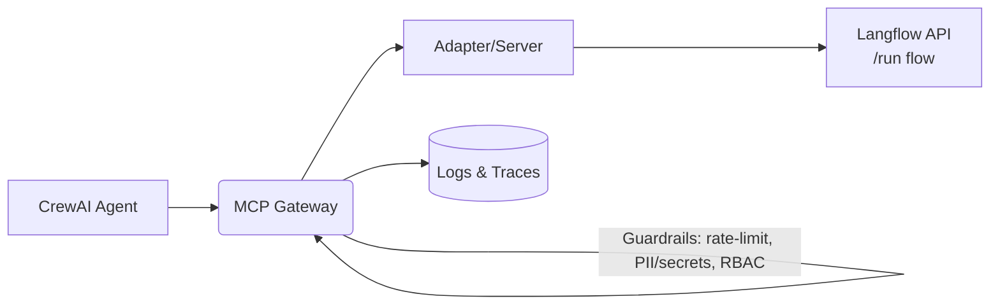

---
template: home.html
title: MCP Gateway Masterclass
description: Build governed, production-grade agentic AI with an MCP Gateway. Hands-on labs + capstone with CrewAI and Langflow.
---

<p align="center">
  <a href="https://www.python.org" target="_blank" rel="noopener">
    
  </a>
  <a href="https://fastapi.tiangolo.com" target="_blank" rel="noopener">
    
  </a>
  <a href="https://squidfunk.github.io/mkdocs-material/" target="_blank" rel="noopener">
    
  </a>
</p>

---

## Welcome

The **MCP Gateway Masterclass** is a hands-on workshop for building **enterprise-grade agentic AI**. You’ll deploy an **MCP Gateway**, register tools, enforce guardrails, and finish with a **CrewAI + Langflow** capstone running end-to-end.

---

## Quick Start

=== "Run Gateway"

    ```bash
    python3 -m venv .venv && source .venv/bin/activate
    pip install -U mcp-contextforge-gateway
    mcpgateway --host 0.0.0.0 --port 4444
    curl -s http://localhost:4444/health | jq .
    ```

=== "Generate Token"

    ```bash
    export MCPGATEWAY_BEARER_TOKEN=$(python3 -m mcpgateway.utils.create_jwt_token \
      --username admin@example.com --exp 10080 --secret my-test-key)
    ```

=== "List Tools"

    ```bash
    mcp --server http://localhost:4444 tools list
    ```

---

## Workshop Map

<div class="grid cards" markdown="1">

* :material-compass-outline: **Syllabus**

    ^^^

    2 days × (4h theory AM + 4h labs PM) — from quickstart to production patterns.
    [:octicons-arrow-right-16: Open »](syllabus.md){ .md-button .md-button--primary }

* :material-rocket-launch-outline: **Quickstart**

    ^^^

    Bring the gateway up locally, health checks, tokens, and first tools.
    [:octicons-arrow-right-16: Open »](quickstart.md){ .md-button .md-button--primary }

* :material-flask-outline: **Labs (Day 1)**

    ^^^

    Register servers, use clients, wrappers, and rate-limit.
    [:octicons-arrow-right-16: Open »](labs.md){ .md-button .md-button--primary }

* :material-robot-outline: **Capstone (Day 2)**

    ^^^

    CrewAI agent + Langflow tool via the Gateway with guardrails & RBAC.
    [:octicons-arrow-right-16: Open »](capstone.md){ .md-button .md-button--primary }

</div>

---

## Architecture at a Glance


