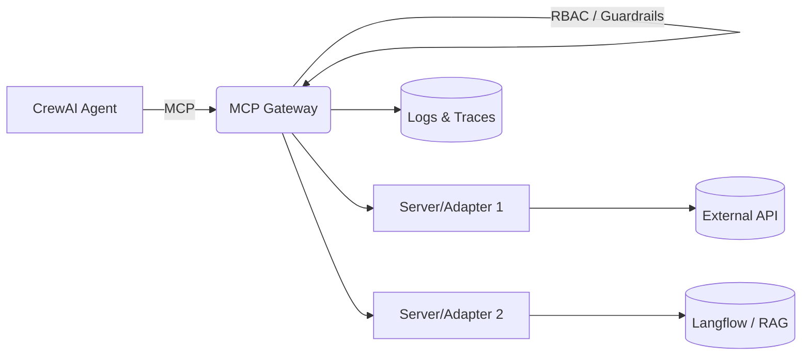

# Part I — Foundations (Day‑1, AM Theory)

## 3.1 What is MCP and Why a Gateway

**Model Context Protocol (MCP)** standardizes how agents communicate with *tool servers* that expose **tools**, **resources**, and **prompts**.

**The MCP Gateway** sits in front of many MCP servers and REST sources to:

- **Federate tools** into a unified, discoverable catalog
- **Enforce policy** with plugins (pre/post hooks), RBAC, and authentication
- **Observe** every call (structured logs + OTEL traces)
- **Abstract transport:** SSE, streamable HTTP, stdio, WebSockets

**Mental model**
```
Agent ↔ Gateway ↔ MCP Servers / REST APIs
```

**Example — A tool contract (JSON Schema)**
```json
{
  "name": "calc.add",
  "description": "Return a + b",
  "schema": {
    "type": "object",
    "properties": { "a": { "type": "number" }, "b": { "type": "number" } },
    "required": ["a", "b"]
  }
}
```

---

## 3.2 Architecture and Core Concepts

- **Gateway**: reverse proxy + registry + policy engine
- **MCP Server**: serves tools/resources/prompts
- **Virtual Servers**: group tools logically
- **Plugins**: middleware hooks for rate limit, secrets/PII, schema guard, retries
- **Auth & RBAC**: JWT/OAuth; role-based access per tool
- **Observability**: JSON logs + OTEL → Phoenix/APM

**High‑level diagram**


---

## 3.3 Agents & Clients Overview

- **Agents**: CrewAI, LangChain, LangGraph, LlamaIndex, Semantic Kernel, OpenAI SDK
- **Clients**: MCP CLI, Inspector, IDE clients (Continue, Cline, Claude Desktop), OpenWebUI
- **Pattern**: point all agents at **one** gateway; discover/invoke tools from there

*Minimal CrewAI example*:

```python
from crewai import Agent, Task, Crew
analyst = Agent(role="Analyst", goal="Summarize inputs concisely", backstory="Operates under gateway policies")
task = Task(description="Summarize: {text}", expected_output="2-3 sentences", agent=analyst)
print(Crew(agents=[analyst], tasks=[task]).kickoff(inputs={"text":"MCP Gateway centralizes governance for tools."}))
```

---

## 3.4 Serving Patterns: gRPC, REST, Reverse Proxy, Wrappers

Expose capabilities by direct MCP servers, reverse proxies, or HTTP wrappers.

*Adapter sketch (FastAPI wrapping httpbin):*

```python
from fastapi import FastAPI, HTTPException
import requests
app = FastAPI(); UPSTREAM="https://httpbin.org/get"
@app.get("/tools")
def tools(): return {"tools":[{"name":"httpbin.get","schema":{"type":"object","properties":{"q":{"type":"string"}}}}]}
@app.post("/call/httpbin.get")
def call(payload: dict):
  try:
    r = requests.get(UPSTREAM, params={"q":payload.get("q","")}, timeout=10); r.raise_for_status()
    return {"status": r.status_code, "json": r.json()}
  except Exception as e:
    raise HTTPException(status_code=502, detail=str(e))
```

---

## 3.5 Security & Governance Essentials

**JWT + RBAC** and guardrails (rate limiter, secrets/PII, schema guards) at the gateway.

*RBAC example*

```yaml
rbac:
  roles:
    - name: admin
      allow_all: true
    - name: analyst
      allow_tools: ["calc.add", "lf.summarize"]
    - name: viewer
      allow_tools: []
```

*Rate limiter*

```yaml
plugins:
  - name: rate_limiter
    kind: plugins.rate_limiter.rate_limiter.RateLimiterPlugin
    hooks: ["prompt_pre_fetch","tool_pre_invoke"]
    mode: enforce
    priority: 50
    config: { by_user: "60/m", by_tenant: "600/m", by_tool: "30/m", burst: 5 }
```

---

## 3.6 Observability & Telemetry

Enable OTEL and export to Phoenix:

```bash
docker run -p 6006:6006 -p 4317:4317 arizephoenix/phoenix:latest
export OTEL_ENABLE_OBSERVABILITY=true
export OTEL_TRACES_EXPORTER=otlp
export OTEL_EXPORTER_OTLP_ENDPOINT=http://localhost:4317
mcpgateway --host 0.0.0.0 --port 4444
```
